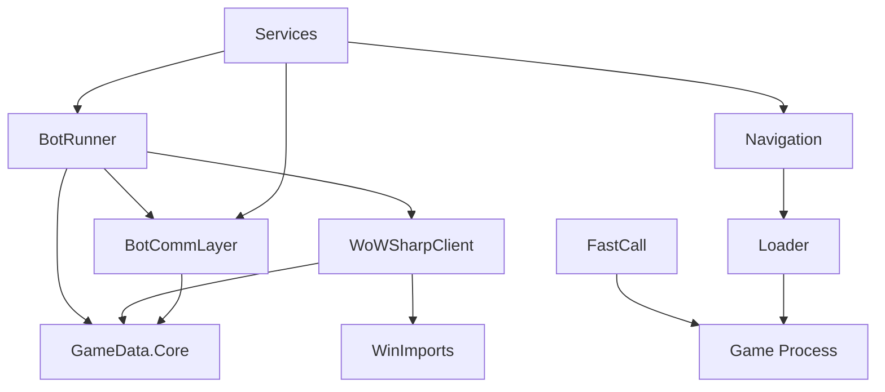

# BloogBot Exports Overview

The **Exports** directory contains the core libraries and components that form the foundation of the BloogBot World of Warcraft automation ecosystem. These projects provide essential functionality for game interaction, communication, data management, and automation orchestration. See the repository root [Documentation Map](../README.md#documentation-map) for links to related services, UI tooling, and the recorded test harness.

## Quick Reference

| Project | Type | Purpose | Key Features |
|---------|------|---------|--------------|
| [**WoWSharpClient**](WoWSharpClient/README.md) | C# Library | Pure C# WoW network protocol client | Authentication, object management, movement control |
| [**BotRunner**](BotRunner/README.md) | C# Library | Bot automation engine with behavior trees | Intelligent decision making, pathfinding integration |
| [**BotCommLayer**](BotCommLayer/README.md) | C# Library | Inter-service communication infrastructure | Protocol Buffers messaging, TCP sockets |
| [**GameData.Core**](GameData.Core/README.md) | C# Library | Core game data structures and interfaces | WoW object models, enumerations, type definitions |
| [**FastCall**](FastCall/README.md) | C++ DLL | Native game function interop bridge | Memory marshaling, calling convention support |
| [**Loader**](Loader/README.md) | C++ DLL | CLR hosting and DLL injection | Process injection, managed code execution |
| [**Navigation**](Navigation/README.md) | C++ DLL | Pathfinding and collision detection | A* pathfinding, navigation meshes, physics |
| [**WinImports**](WinImports/README.md) | C# Library | Windows API P/Invoke wrapper | Process management, memory operations |

## Architecture Overview

The BloogBot exports are organized into several functional layers:

### Core Infrastructure Layer
- **GameData.Core**: Foundational data types, interfaces, and enumerations
- **WinImports**: Windows API wrappers for system interaction
- **BotCommLayer**: Service communication and messaging infrastructure

### Game Interaction Layer
- **WoWSharpClient**: Pure C# WoW protocol implementation for network communication
- **FastCall**: Native bridge for legacy calling conventions and memory operations
- **Loader**: Process injection and managed code hosting

### Automation Layer
- **BotRunner**: High-level bot orchestration with behavior trees
- **Navigation**: Advanced pathfinding and collision detection

## Key Capabilities

### Network Communication
- **WoWSharpClient** provides a complete C# implementation of the WoW network protocol
- Handles authentication (SRP), realm selection, character management, and world communication
- Supports encrypted sessions, object updates, movement synchronization, and chat messaging
- See: [WoWSharpClient README](WoWSharpClient/README.md)

### Bot Automation
- **BotRunner** orchestrates intelligent bot behavior using behavior trees
- Supports complex decision making, quest handling, combat, trading, and social interactions
- Integrates with pathfinding services for advanced movement and navigation
- See: [BotRunner README](BotRunner/README.md)

### Service Communication
- **BotCommLayer** enables distributed bot architecture with Protocol Buffers messaging
- Provides TCP socket communication for coordinating multiple bot services
- Includes comprehensive game object models and action definitions
- See: [BotCommLayer README](BotCommLayer/README.md)

### Navigation & Pathfinding
- **Navigation** provides A* pathfinding using Detour navigation meshes
- Supports line-of-sight checks, collision detection, and multi-map terrain navigation
- Integrates with C# services through P/Invoke wrappers
- See: [Navigation README](Navigation/README.md)

### System Integration
- **Loader** enables injection of managed .NET code into game processes
- **FastCall** bridges managed C# code with native game functions
- **WinImports** provides safe Windows API access for process and memory management
- See: [Loader README](Loader/README.md), [FastCall README](FastCall/README.md), [WinImports README](WinImports/README.md)

## Native C++ Components Integration

The BloogBot ecosystem includes three critical native C++ DLLs that provide advanced functionality:

### FastCall.dll - Function Interop Bridge
**Purpose**: Enables managed C# code to call game functions with proper calling conventions

**Key Exported Functions**:
- `LuaCall()` - Execute Lua scripts within the game client
- `EnumerateVisibleObjects()` - Query visible game objects
- `BuyVendorItem()` / `SellItemByGuid()` - Vendor interactions
- `LootSlot()` - Automated looting
- `Intersect()` / `Intersect2()` - 3D collision detection

**Integration Pattern**:
```csharp
// C# P/Invoke wrapper in ForegroundBotRunner
[DllImport("FastCall.dll", EntryPoint = "LuaCall")]
private static extern void LuaCallFunction(string code, int ptr);

// Usage
Functions.LuaCall("CastSpellByName('Fireball')");
```

### Loader.dll - CLR Hosting
**Purpose**: Hosts .NET runtime within game process for direct memory access

**Key Features**:
- CLR 4.0+ hosting with legacy v2 fallback
- Loads `WoWActivityMember.exe` as managed entry point
- Thread-safe CLR initialization
- Debug support with console allocation

**Integration Flow**:
1. DLL injected into WoW.exe process
2. `DllMain` triggers CLR initialization
3. Managed assembly loaded and executed
4. Bot gains direct memory access capabilities

### Navigation.dll - Pathfinding Engine
**Purpose**: Provides advanced pathfinding using Detour navigation meshes

**Key API Methods**:
- `CalculatePath()` - A* pathfinding between coordinates
- `IsLineOfSight()` - Visibility testing
- `CapsuleOverlap()` - Collision detection
- `RaycastToWmoMesh()` - World geometry queries

**Integration Pattern**:
```csharp
// C# wrapper in PathfindingService
[DllImport("Navigation.dll", CallingConvention = CallingConvention.Cdecl)]
private static extern IntPtr FindPath(uint mapId, XYZ start, XYZ end, bool smoothPath, out int length);

// High-level usage
var path = navigationService.CalculatePath(mapId, startPos, endPos, smoothing: true);
```

## Development Guidelines

### Project Dependencies


### Technology Stack
- **Managed Code**: .NET 8 with C# 12, nullable reference types, implicit usings
- **Native Code**: C++17/C++20 with Visual Studio 2022 toolset
- **Communication**: Protocol Buffers, TCP sockets, System.Reactive
- **Navigation**: Detour navigation meshes, A* pathfinding
- **Security**: SRP authentication, encrypted sessions, anti-cheat countermeasures

### Build Configuration
All projects output to the shared `Bot/` directory:
- **Debug**: `Bot/Debug/net8.0/`
- **Release**: `Bot/Release/net8.0/`

This enables seamless integration and deployment of the complete bot ecosystem.

### Native C++ Build Requirements

#### Prerequisites
- **Visual Studio 2022** with C++ workload
- **Windows 10 SDK** (latest version)
- **Platform Toolset**: v143 or compatible

#### Platform Support
| Project | Win32 | x64 | Configuration |
|---------|-------|-----|---------------|
| FastCall | Yes | Yes | Debug/Release |
| Loader | Yes | Yes | Debug/Release |
| Navigation | Yes | Yes | Debug/Release |

#### Language Standards
- **FastCall**: C++14 (compatibility with game client)
- **Loader**: C++17 (Debug), C++20 (Release)
- **Navigation**: C++20 with modern STL features

### Memory Management Patterns

The native components follow specific memory management patterns:

**FastCall**: Thin wrapper functions with minimal allocation
```cpp
// Functions act as bridges to game memory
extern "C" __declspec(dllexport) void LuaCall(char* code, unsigned int ptr);
```

**Loader**: CLR hosting with automatic cleanup
```cpp
// Thread-safe CLR initialization
DWORD ThreadMain(LPVOID lpParameter);
```

**Navigation**: Singleton pattern with mesh caching
```cpp
// Cached navigation mesh access
Navigation* Navigation::GetInstance();
```

## Getting Started

### For Bot Users
1. **Read the Architecture**: Start with [WoWSharpClient](WoWSharpClient/README.md) to understand network communication
2. **Understand Automation**: Review [BotRunner](BotRunner/README.md) for behavior and decision making
3. **Explore Services**: Check [BotCommLayer](BotCommLayer/README.md) for service coordination

### For Developers
1. **Core Data**: Begin with [GameData.Core](GameData.Core/README.md) for foundational types
2. **System Integration**: Study [Loader](Loader/README.md) and [FastCall](FastCall/README.md) for injection mechanics
3. **Advanced Features**: Explore [Navigation](Navigation/README.md) for pathfinding implementation

### For Service Developers
1. **Communication**: Start with [BotCommLayer](BotCommLayer/README.md) for messaging patterns
2. **Windows Integration**: Use [WinImports](WinImports/README.md) for system operations
3. **Game Integration**: Leverage [WoWSharpClient](WoWSharpClient/README.md) for game state access

### For Native C++ Developers
1. **Function Bridging**: Examine [FastCall](FastCall/README.md) for calling convention patterns
2. **Process Injection**: Study [Loader](Loader/README.md) for CLR hosting techniques
3. **Pathfinding**: Analyze [Navigation](Navigation/README.md) for Detour integration

## Deployment Considerations

### Runtime Dependencies
**Managed Components**:
- .NET 8 Runtime
- Protocol Buffers libraries
- Azure AI services (optional)

**Native Components**:
- Visual C++ Redistributable 2022
- Windows API compatibility
- Game client memory layout compatibility

### Security and Anti-Detection

**WoWSharpClient Approach**:
- Pure network protocol implementation
- No memory injection or client modification
- Educational and research focus

**Native Component Approach**:
- Direct memory access capabilities
- Process injection techniques
- Advanced anti-detection measures
- Requires elevated privileges

**Deployment Strategy**:
- Choose approach based on requirements
- WoWSharpClient for network-only automation
- Native components for advanced memory operations

## Educational Value

The BloogBot exports serve as comprehensive educational resources for:

- **Network Protocol Implementation**: Complete WoW protocol in pure C#
- **Behavior Tree Systems**: Advanced AI decision making patterns
- **Process Injection**: CLR hosting and DLL injection techniques
- **Game Automation**: Pathfinding, collision detection, and bot orchestration
- **Distributed Systems**: Service communication and coordination patterns
- **Native Interop**: P/Invoke patterns and calling convention bridging

## Troubleshooting Common Issues

### Native DLL Loading Problems
```
Issue: "Unable to load Navigation.dll"
Solutions:
- Verify Visual C++ Redistributable is installed
- Check DLL architecture matches process (x86/x64)
- Ensure all dependencies are in the same directory
- Verify Windows version compatibility
```

### P/Invoke Marshaling Errors
```
Issue: "PInvokeStackImbalance was detected"
Solutions:
- Verify calling conventions match (CallingConvention.Cdecl/StdCall)
- Check parameter types and order
- Ensure proper structure layouts with [StructLayout]
- Validate pointer lifetime management
```

### CLR Hosting Failures
```
Issue: "Unable to load the CLR runtime"
Solutions:
- Verify .NET Framework 4.0+ is installed
- Check process architecture compatibility
- Ensure managed assembly is accessible
- Review Windows security policies
```

## Safety & Compliance

**Important**: These libraries are designed for educational and research purposes. They implement protocols and techniques without reverse engineering or game client modification.

- **No Memory Injection**: WoWSharpClient uses pure network communication
- **Educational Focus**: Emphasizes learning network protocols and automation patterns
- **Compliance Responsibility**: Users must ensure compliance with applicable terms of service

## Support & Community

- **Documentation**: Each project includes comprehensive README files with usage examples
- **Architecture**: Code is well-commented and follows established patterns
- **Integration**: Projects are designed to work together as a cohesive ecosystem

---

*For detailed information about any specific component, please refer to the individual project README files linked above.*
