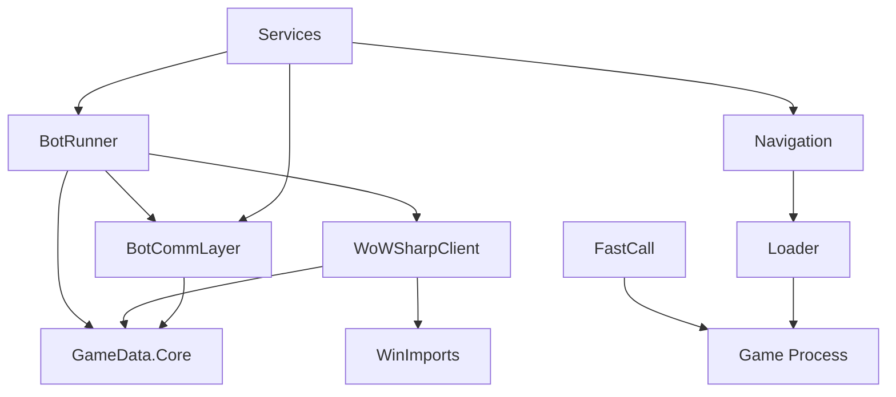

# Exports - Core Libraries and Native Components
# BloogBot Exports Overview

> **Part of WWoW (Westworld of Warcraft)** - An AI-driven simulation platform for WoW-style game environments.
The **Exports** directory contains the core libraries and components that form the foundation of the BloogBot World of Warcraft automation ecosystem. These projects provide essential functionality for game interaction, communication, data management, and automation orchestration. See the repository root [Documentation Map](../README.md#documentation-map) for links to related services, UI tooling, and the recorded test harness.

## Overview

The **Exports** directory contains the core shared libraries (C# and C++) that power the WWoW system. These components provide the foundational capabilities for both injected (ForegroundBotRunner) and headless (BackgroundBotRunner) bot implementations.

## Directory Structure

```
Exports/
??? BotCommLayer/        # Protobuf IPC communication
??? BotRunner/           # Behavior tree framework and clients
??? FastCall/            # C++ x86 calling convention helper
??? GameData.Core/       # Shared interfaces and models
??? Loader/              # C++ CLR bootstrapper for DLL injection
??? Navigation/          # C++ pathfinding and physics engine
??? WinImports/          # Windows P/Invoke declarations
??? WoWSharpClient/      # Pure C# WoW protocol implementation
```

## Component Summary

| Component | Type | Purpose |
|-----------|------|---------|
| **BotCommLayer** | C# Library | Protobuf message definitions and socket infrastructure |
| **BotRunner** | C# Library | Behavior trees, pathfinding client, state coordination |
| **FastCall** | C++ DLL | x86 fastcall helper for legacy function invocation |
| **GameData.Core** | C# Library | Game object interfaces (IWoWUnit, IObjectManager, etc.) |
| **Loader** | C++ DLL | CLR bootstrapper for injection-based bot execution |
| **Navigation** | C++ DLL | Detour/Recast pathfinding and physics simulation |
| **WinImports** | C# Library | Windows API P/Invoke declarations |
| **WoWSharpClient** | C# Library | Headless WoW client via network protocol |

## Architecture Overview

```
                        WWoW System
???????????????????????????????????????????????????????????????????????
?                    Consumer Layer                                   ?
?  ???????????????????????  ???????????????????????                   ?
?  ? ForegroundBotRunner ?  ? BackgroundBotRunner ?                   ?
?  ? (Injected)          ?  ? (Headless)          ?                   ?
?  ???????????????????????  ???????????????????????                   ?
???????????????????????????????????????????????????????????????????????
?                     Exports Layer                                   ?
?                                                                     ?
?  ????????????????  ????????????????  ????????????????               ?
?  ?  BotRunner   ?  ? GameData.Core?  ? BotCommLayer ?               ?
?  ?(Orchestration)? ? (Interfaces) ?  ?   (IPC)      ?               ?
?  ????????????????  ????????????????  ????????????????               ?
?                                                                     ?
?  ????????????????  ????????????????  ????????????????               ?
?  ?WoWSharpClient?  ?  WinImports  ?  ?   Loader     ?               ?
?  ?  (Network)   ?  ?  (P/Invoke)  ?  ?  (C++ CLR)   ?               ?
?  ????????????????  ????????????????  ????????????????               ?
?                                                                     ?
?  ????????????????  ????????????????                                 ?
?  ?  Navigation  ?  ?   FastCall   ?                                 ?
?  ? (C++ Physics)?  ? (C++ Calling)?                                 ?
?  ????????????????  ????????????????                                 ?
???????????????????????????????????????????????????????????????????????
```

---

# Core Bot Engine (ForegroundBotRunner Architecture)

The **Core Bot Engine** runs inside the World of Warcraft game process to enable in-process bot functionality. It is responsible for low-level memory access and in-game function calls, acting as the bridge between the game client and higher-level bot logic. Its main roles include:

- **Reading/writing game memory** for state inspection and manipulation
- **Calling internal game functions** (e.g., to move or cast spells)
- **Hooking game routines** (especially anti-cheat functions) for stealth operation

By encapsulating these tasks, the Core Bot Engine provides a safe, high-performance API that higher-level modules can use without dealing with the complexities of memory manipulation and anti-cheat bypass.

## High-Level Architecture and Injection Process
## Quick Reference

The Core Bot Engine runs *inside* the WoW process. This is achieved by a separate injector program (the **Bootstrapper**) that:
| Project | Type | Purpose | Key Features |
|---------|------|---------|--------------|
| [**WoWSharpClient**](WoWSharpClient/README.md) | C# Library | Pure C# WoW network protocol client | Authentication, object management, movement control |
| [**BotRunner**](BotRunner/README.md) | C# Library | Bot automation engine with behavior trees | Intelligent decision making, pathfinding integration |
| [**BotCommLayer**](BotCommLayer/README.md) | C# Library | Inter-service communication infrastructure | Protocol Buffers messaging, TCP sockets |
| [**GameData.Core**](GameData.Core/README.md) | C# Library | Core game data structures and interfaces | WoW object models, enumerations, type definitions |
| [**FastCall**](FastCall/README.md) | C++ DLL | Native game function interop bridge | Memory marshaling, calling convention support |
| [**Loader**](Loader/README.md) | C++ DLL | CLR hosting and DLL injection | Process injection, managed code execution |
| [**Navigation**](Navigation/README.md) | C++ DLL | Pathfinding and collision detection | A* pathfinding, navigation meshes, physics |
| [**WinImports**](WinImports/README.md) | C# Library | Windows API P/Invoke wrapper | Process management, memory operations |

1. Launches the WoW client process
2. Allocates memory in WoW to write the path of `Loader.dll`
3. Creates a remote thread to load `Loader.dll` into WoW
## Architecture Overview

Once injected, `Loader.dll` bootstraps within the game process:
The BloogBot exports are organized into several functional layers:

1. Starts the .NET Common Language Runtime (CLR) inside WoW
2. Loads the WWoW core assembly
3. Initializes all bot subsystems

### Native Helper (FastCall.dll)

In addition to `Loader.dll`, the bot uses **FastCall.dll** for certain function calls on older game clients (e.g., Vanilla WoW 1.12.1). This DLL exports helper functions that invoke game routines with calling conventions that .NET cannot easily handle directly (such as x86 fastcall).

For newer expansions (TBC/WotLK), the FastCall helper is largely bypassed in favor of direct delegate calls from C#.

## Memory Access: Reading and Writing Game Memory
### Core Infrastructure Layer
- **GameData.Core**: Foundational data types, interfaces, and enumerations
- **WinImports**: Windows API wrappers for system interaction
- **BotCommLayer**: Service communication and messaging infrastructure

The **MemoryManager** provides safe memory access:
### Game Interaction Layer
- **WoWSharpClient**: Pure C# WoW protocol implementation for network communication
- **FastCall**: Native bridge for legacy calling conventions and memory operations
- **Loader**: Process injection and managed code hosting

```csharp
// Read primitive types
var health = MemoryManager.ReadInt(unitBase + Offsets.Health);
var position = MemoryManager.ReadFloat(playerBase + Offsets.PosX);
### Automation Layer
- **BotRunner**: High-level bot orchestration with behavior trees
- **Navigation**: Advanced pathfinding and collision detection

// Write to game memory
MemoryManager.WriteInt(targetAddress, newValue);
MemoryManager.WriteBytes(codeAddress, patchBytes);
```
## Key Capabilities

### Memory Addresses

The `MemoryAddresses.cs` file contains addresses for each supported client version:

| Version | Build | Addresses |
|---------|-------|-----------|
| Vanilla | 5875 | Player data, object list, function pointers |
| TBC | 8606 | Same structure, different offsets |
| WotLK | 12340 | Same structure, different offsets |

## Calling Internal Game Functions
### Network Communication
- **WoWSharpClient** provides a complete C# implementation of the WoW network protocol
- Handles authentication (SRP), realm selection, character management, and world communication
- Supports encrypted sessions, object updates, movement synchronization, and chat messaging
- See: [WoWSharpClient README](WoWSharpClient/README.md)

The bot calls game functions via C# delegates with exact signatures:
### Bot Automation
- **BotRunner** orchestrates intelligent bot behavior using behavior trees
- Supports complex decision making, quest handling, combat, trading, and social interactions
- Integrates with pathfinding services for advanced movement and navigation
- See: [BotRunner README](BotRunner/README.md)

```csharp
// Define delegate with correct calling convention
[UnmanagedFunctionPointer(CallingConvention.Cdecl)]
delegate int CastSpellByIdDelegate(ulong targetGuid, int spellId, bool unknown);
### Service Communication
- **BotCommLayer** enables distributed bot architecture with Protocol Buffers messaging
- Provides TCP socket communication for coordinating multiple bot services
- Includes comprehensive game object models and action definitions
- See: [BotCommLayer README](BotCommLayer/README.md)

// Create delegate from function address
var CastSpell = Marshal.GetDelegateForFunctionPointer<CastSpellByIdDelegate>(
    (IntPtr)MemoryAddresses.CastSpellById);
### Navigation & Pathfinding
- **Navigation** provides A* pathfinding using Detour navigation meshes
- Supports line-of-sight checks, collision detection, and multi-map terrain navigation
- Integrates with C# services through P/Invoke wrappers
- See: [Navigation README](Navigation/README.md)

// Call game function
CastSpell(targetGuid, spellId, false);
```
### System Integration
- **Loader** enables injection of managed .NET code into game processes
- **FastCall** bridges managed C# code with native game functions
- **WinImports** provides safe Windows API access for process and memory management
- See: [Loader README](Loader/README.md), [FastCall README](FastCall/README.md), [WinImports README](WinImports/README.md)

### IGameFunctionHandler Pattern
## Native C++ Components Integration

Each expansion has a specific handler:
The BloogBot ecosystem includes three critical native C++ DLLs that provide advanced functionality:

- `VanillaGameFunctionHandler` - Uses FastCall.dll for some functions
- `TBCGameFunctionHandler` - Direct delegate calls
- `WotLKGameFunctionHandler` - Direct delegate calls
### FastCall.dll - Function Interop Bridge
**Purpose**: Enables managed C# code to call game functions with proper calling conventions

The `Functions` static class provides version-agnostic access:
**Key Exported Functions**:
- `LuaCall()` - Execute Lua scripts within the game client
- `EnumerateVisibleObjects()` - Query visible game objects
- `BuyVendorItem()` / `SellItemByGuid()` - Vendor interactions
- `LootSlot()` - Automated looting
- `Intersect()` / `Intersect2()` - 3D collision detection

**Integration Pattern**:
```csharp
// C# P/Invoke wrapper in ForegroundBotRunner
[DllImport("FastCall.dll", EntryPoint = "LuaCall")]
private static extern void LuaCallFunction(string code, int ptr);

// Usage
Functions.LuaCall("CastSpellByName('Fireball')");
```

### Loader.dll - CLR Hosting
**Purpose**: Hosts .NET runtime within game process for direct memory access

**Key Features**:
- CLR 4.0+ hosting with legacy v2 fallback
- Loads `WoWActivityMember.exe` as managed entry point
- Thread-safe CLR initialization
- Debug support with console allocation

**Integration Flow**:
1. DLL injected into WoW.exe process
2. `DllMain` triggers CLR initialization
3. Managed assembly loaded and executed
4. Bot gains direct memory access capabilities

### Navigation.dll - Pathfinding Engine
**Purpose**: Provides advanced pathfinding using Detour navigation meshes

**Key API Methods**:
- `CalculatePath()` - A* pathfinding between coordinates
- `IsLineOfSight()` - Visibility testing
- `CapsuleOverlap()` - Collision detection
- `RaycastToWmoMesh()` - World geometry queries

**Integration Pattern**:
```csharp
// C# wrapper in PathfindingService
[DllImport("Navigation.dll", CallingConvention = CallingConvention.Cdecl)]
private static extern IntPtr FindPath(uint mapId, XYZ start, XYZ end, bool smoothPath, out int length);

// High-level usage
var path = navigationService.CalculatePath(mapId, startPos, endPos, smoothing: true);
```

## Development Guidelines

### Project Dependencies


### Technology Stack
- **Managed Code**: .NET 8 with C# 12, nullable reference types, implicit usings
- **Native Code**: C++17/C++20 with Visual Studio 2022 toolset
- **Communication**: Protocol Buffers, TCP sockets, System.Reactive
- **Navigation**: Detour navigation meshes, A* pathfinding
- **Security**: SRP authentication, encrypted sessions, anti-cheat countermeasures

### Build Configuration
All projects output to the shared `Bot/` directory:
- **Debug**: `Bot/Debug/net8.0/`
- **Release**: `Bot/Release/net8.0/`

This enables seamless integration and deployment of the complete bot ecosystem.

### Native C++ Build Requirements

```csharp
// Version-agnostic API
Functions.CastSpellById(spellId, targetGuid);
Functions.ClickToMove(position);
Functions.InteractWithNpc(npcGuid);
```
#### Prerequisites
- **Visual Studio 2022** with C++ workload
- **Windows 10 SDK** (latest version)
- **Platform Toolset**: v143 or compatible

#### Platform Support
| Project | Win32 | x64 | Configuration |
|---------|-------|-----|---------------|
| FastCall | Yes | Yes | Debug/Release |
| Loader | Yes | Yes | Debug/Release |
| Navigation | Yes | Yes | Debug/Release |

## Anti-Cheat Countermeasures (Warden Bypass)
#### Language Standards
- **FastCall**: C++14 (compatibility with game client)
- **Loader**: C++17 (Debug), C++20 (Release)
- **Navigation**: C++20 with modern STL features

The Core Bot Engine implements countermeasures against WoW's **Warden** anti-cheat:
### Memory Management Patterns

### Module Scanning Hook
The native components follow specific memory management patterns:

WWoW hooks `Module32First` and `Module32Next` to hide its DLLs:
**FastCall**: Thin wrapper functions with minimal allocation
```cpp
// Functions act as bridges to game memory
extern "C" __declspec(dllexport) void LuaCall(char* code, unsigned int ptr);
```

```
Warden: "List all loaded modules"
? WWoW intercepts and filters out:
  - Loader.dll
  - FastCall.dll
  - WWoW assemblies
? Warden sees only legitimate game modules
```
**Loader**: CLR hosting with automatic cleanup
```cpp
// Thread-safe CLR initialization
DWORD ThreadMain(LPVOID lpParameter);
```

### Memory Scanning Hook
**Navigation**: Singleton pattern with mesh caching
```cpp
// Cached navigation mesh access
Navigation* Navigation::GetInstance();
```

WWoW hooks Warden's `PageScan` and `MemScan` functions:
## Getting Started

```
Warden: "Read memory at address X"
? WWoW intercepts:
  1. Temporarily restore original bytes at X
  2. Let Warden read "clean" memory
  3. Re-apply WWoW's patches
? Warden sees unmodified game memory
```
### For Bot Users
1. **Read the Architecture**: Start with [WoWSharpClient](WoWSharpClient/README.md) to understand network communication
2. **Understand Automation**: Review [BotRunner](BotRunner/README.md) for behavior and decision making
3. **Explore Services**: Check [BotCommLayer](BotCommLayer/README.md) for service coordination

### HackManager
### For Developers
1. **Core Data**: Begin with [GameData.Core](GameData.Core/README.md) for foundational types
2. **System Integration**: Study [Loader](Loader/README.md) and [FastCall](FastCall/README.md) for injection mechanics
3. **Advanced Features**: Explore [Navigation](Navigation/README.md) for pathfinding implementation

All patches are registered with `HackManager` for coordinated cloaking:
### For Service Developers
1. **Communication**: Start with [BotCommLayer](BotCommLayer/README.md) for messaging patterns
2. **Windows Integration**: Use [WinImports](WinImports/README.md) for system operations
3. **Game Integration**: Leverage [WoWSharpClient](WoWSharpClient/README.md) for game state access

```csharp
// Register a patch
var hack = new Hack("SpeedHack", address, originalBytes, newBytes);
HackManager.Register(hack);
### For Native C++ Developers
1. **Function Bridging**: Examine [FastCall](FastCall/README.md) for calling convention patterns
2. **Process Injection**: Study [Loader](Loader/README.md) for CLR hosting techniques
3. **Pathfinding**: Analyze [Navigation](Navigation/README.md) for Detour integration

// During Warden scan, all registered hacks are temporarily disabled
```
## Deployment Considerations

> ?? **Warning**: These measures are tailored for specific private server Warden implementations. Botting is never 100% safe.
### Runtime Dependencies
**Managed Components**:
- .NET 8 Runtime
- Protocol Buffers libraries
- Azure AI services (optional)

## Developer Onboarding Guide
**Native Components**:
- Visual C++ Redistributable 2022
- Windows API compatibility
- Game client memory layout compatibility

### Key Files and Classes
### Security and Anti-Detection

| File | Purpose |
|------|---------|
| `MemoryManager.cs` | All memory read/write operations |
| `MemoryAddresses.cs` | Address database per client version |
| `IGameFunctionHandler.cs` | Interface for game function calls |
| `Functions.cs` | Version-agnostic game function facade |
| `ObjectManager.cs` | Game object enumeration and wrappers |
| `WardenDisabler.cs` | Anti-cheat hook implementation |
| `HackManager.cs` | Memory patch registration and management |
| `Detour.cs` | Inline function hooking |
**WoWSharpClient Approach**:
- Pure network protocol implementation
- No memory injection or client modification
- Educational and research focus

### Adding a New Game API Call
**Native Component Approach**:
- Direct memory access capabilities
- Process injection techniques
- Advanced anti-detection measures
- Requires elevated privileges

1. **Find the function address** for each game version
2. **Add to MemoryAddresses.cs**:
   ```csharp
   public static readonly uint NewFunction = 0x00123456;
   ```
3. **Define delegate in GameFunctionHandler**:
   ```csharp
   [UnmanagedFunctionPointer(CallingConvention.Cdecl)]
   delegate void NewFunctionDelegate(int param1);
   ```
4. **Add to IGameFunctionHandler interface**
5. **Expose in Functions.cs**
**Deployment Strategy**:
- Choose approach based on requirements
- WoWSharpClient for network-only automation
- Native components for advanced memory operations

### Reading New Memory Values
## Educational Value

1. **Find the address/offset** via reverse engineering
2. **Add to MemoryAddresses.cs** (for static globals)
3. **Implement read in appropriate class**:
   ```csharp
   public int NewValue => MemoryManager.ReadInt(
       ObjectManager.PlayerBase + Offsets.NewValue);
   ```
The BloogBot exports serve as comprehensive educational resources for:

### Debugging Techniques
- **Network Protocol Implementation**: Complete WoW protocol in pure C#
- **Behavior Tree Systems**: Advanced AI decision making patterns
- **Process Injection**: CLR hosting and DLL injection techniques
- **Game Automation**: Pathfinding, collision detection, and bot orchestration
- **Distributed Systems**: Service communication and coordination patterns
- **Native Interop**: P/Invoke patterns and calling convention bridging

1. **Compile in Debug mode**
2. **Launch via Bootstrapper** (as admin)
3. **Attach Visual Studio to WoW.exe** after injection
4. **Set breakpoints** in managed code
5. **Use console output** for logging (Loader opens a console)
## Troubleshooting Common Issues

```csharp
// Debug logging
Console.WriteLine($"Player health: {LocalPlayer.Health}");
Logger.Log($"Casting spell {spellId}");
```
### Native DLL Loading Problems
```
Issue: "Unable to load Navigation.dll"
Solutions:
- Verify Visual C++ Redistributable is installed
- Check DLL architecture matches process (x86/x64)
- Ensure all dependencies are in the same directory
- Verify Windows version compatibility
```

### Common Pitfalls
### P/Invoke Marshaling Errors
```
Issue: "PInvokeStackImbalance was detected"
Solutions:
- Verify calling conventions match (CallingConvention.Cdecl/StdCall)
- Check parameter types and order
- Ensure proper structure layouts with [StructLayout]
- Validate pointer lifetime management
```

| Issue | Cause | Solution |
|-------|-------|----------|
| Instant crash | Wrong calling convention | Verify delegate attributes |
| Silent failure | Wrong address | Use Cheat Engine to verify |
| Access violation | Protected memory | Use MemoryManager.WriteBytes |
| Warden detection | Unregistered hack | Register with HackManager |
### CLR Hosting Failures
```
Issue: "Unable to load the CLR runtime"
Solutions:
- Verify .NET Framework 4.0+ is installed
- Check process architecture compatibility
- Ensure managed assembly is accessible
- Review Windows security policies
```

## Security Notes
## Safety & Compliance

?? **Important**:
**Important**: These libraries are designed for educational and research purposes. They implement protocols and techniques without reverse engineering or game client modification.

- This project is for **private servers only**
- Do not use on official Blizzard servers
- Memory manipulation may trigger anti-cheat on some servers
- The Warden bypass is specific to supported private server implementations
- **No Memory Injection**: WoWSharpClient uses pure network communication
- **Educational Focus**: Emphasizes learning network protocols and automation patterns
- **Compliance Responsibility**: Users must ensure compliance with applicable terms of service

## Related Documentation
## Support & Community

- See `Navigation/README.md` for pathfinding details
- See `BotCommLayer/README.md` for IPC protocol
- See `WoWSharpClient/README.md` for network client
- See `ARCHITECTURE.md` for system overview
- **Documentation**: Each project includes comprehensive README files with usage examples
- **Architecture**: Code is well-commented and follows established patterns
- **Integration**: Projects are designed to work together as a cohesive ecosystem

---

*This component is part of the WWoW (Westworld of Warcraft) simulation platform.*
*For detailed information about any specific component, please refer to the individual project README files linked above.*
