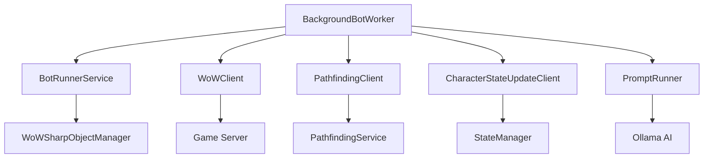

# BackgroundBotRunner

A .NET 8 Worker Service that provides background execution of World of Warcraft bot automation through the BloogBot ecosystem. This service orchestrates bot behavior, pathfinding, character state management, and AI-driven decision making in a background service architecture.

## Overview

BackgroundBotRunner is designed as a library project that encapsulates bot automation logic within a `BackgroundService` implementation. It integrates multiple BloogBot components to provide autonomous character control with intelligent behavior trees, pathfinding, and state synchronization.

### Key Features

- **Background Service Architecture**: Built on .NET 8 Worker Service framework for reliable background execution
- **AI Integration**: Supports Ollama AI models for intelligent decision making
- **Multi-Service Coordination**: Integrates with PathfindingService, StateManager, and character state listeners
- **WoW Network Protocol**: Pure C# implementation through WoWSharpClient for game communication
- **Behavior Trees**: Advanced decision-making system for complex bot behaviors
- **Real-time State Management**: Continuous character state updates and synchronization

## Project Structure

```
BackgroundBotRunner/
??? BackgroundBotWorker.cs     # Main background service implementation
??? BackgroundBotRunner.csproj # Project configuration
??? README.md                  # This documentation
```

## Dependencies

### NuGet Packages
- **Newtonsoft.Json (13.0.3)**: JSON serialization for configuration and communication

### Project References
- **BotRunner**: Core bot automation engine with behavior trees
- **WoWSharpClient**: Pure C# WoW network protocol implementation
- **PromptHandlingService**: AI prompt processing and response handling

### External Services
- **PathfindingService**: Advanced navigation and collision detection
- **StateManager**: Multi-character state coordination
- **Character State Listener**: Real-time character state updates
- **Ollama AI Service**: Large language model integration for intelligent decisions

## Architecture

The BackgroundBotWorker orchestrates several key components:



## Configuration

The service requires configuration for multiple endpoints and AI integration:

### appsettings.json Example

```json
{
  "Ollama": {
    "BaseUri": "http://localhost:11434",
    "Model": "llama2"
  },
  "PathfindingService": {
    "IpAddress": "127.0.0.1",
    "Port": 8080
  },
  "CharacterStateListener": {
    "IpAddress": "127.0.0.1",
    "Port": 8081
  },
  "RealmEndpoint": {
    "IpAddress": "127.0.0.1"
  }
}
```

### Configuration Parameters

| Section | Parameter | Description |
|---------|-----------|-------------|
| **Ollama** | BaseUri | URI of the Ollama AI service endpoint |
| **Ollama** | Model | AI model name (e.g., "llama2", "codellama") |
| **PathfindingService** | IpAddress | IP address of pathfinding service |
| **PathfindingService** | Port | Port number for pathfinding service |
| **CharacterStateListener** | IpAddress | IP address of character state service |
| **CharacterStateListener** | Port | Port number for character state service |
| **RealmEndpoint** | IpAddress | WoW realm server IP address |

## Usage

### Integration with StateManager

The BackgroundBotWorker is typically managed by the StateManager service:

```csharp
public void StartBackgroundBotWorker(string accountName)
{
    var scope = _serviceProvider.CreateScope();
    var tokenSource = new CancellationTokenSource();
    var service = ActivatorUtilities.CreateInstance<BackgroundBotWorker>(
        scope.ServiceProvider,
        _loggerFactory,
        _configuration
    );

    var task = Task.Run(async () => await service.StartAsync(tokenSource.Token));
    _managedServices.Add(accountName, (service, tokenSource, task));
}
```

### Standalone Usage

For development or testing, the service can be used independently:

```csharp
var configuration = new ConfigurationBuilder()
    .AddJsonFile("appsettings.json")
    .Build();

var loggerFactory = LoggerFactory.Create(builder => 
    builder.AddConsole());

var worker = new BackgroundBotWorker(loggerFactory, configuration);
await worker.StartAsync(CancellationToken.None);
```

### Service Lifecycle

The BackgroundBotWorker follows the standard .NET hosted service lifecycle:

1. **Initialization**: Clients and services are configured during construction
2. **Startup**: `ExecuteAsync` is called when the service starts
3. **Execution**: The bot runner operates continuously until cancellation
4. **Shutdown**: Graceful shutdown when cancellation is requested

## Core Components

### BotRunnerService
- Orchestrates bot behavior using behavior trees
- Handles quest execution, combat, trading, and social interactions
- Integrates with pathfinding for intelligent movement

### WoWSharpObjectManager
- Manages game object state and updates
- Provides interface to WoW game world
- Handles object tracking and lifecycle management

### Client Integrations
- **PathfindingClient**: Navigation and collision detection
- **CharacterStateUpdateClient**: State synchronization
- **WoWClient**: Direct game server communication

### AI Integration
- **PromptRunner**: Interfaces with Ollama AI models
- Supports intelligent decision making and adaptive behavior
- Configurable model selection and endpoint management

## Development

### Building the Project

```bash
# Build the project
dotnet build Services/BackgroundBotRunner/BackgroundBotRunner.csproj

# Output location
# Bot/Debug/net8.0/ (or Release)
```

### Project Configuration

The project is configured as a library (`OutputType=Library`) with:
- **.NET 8** target framework
- **Nullable reference types** enabled
- **Implicit usings** for cleaner code
- **User secrets** support for development configuration
- **Shared output path** to `Bot/` directory for ecosystem integration

### Testing

While this project doesn't include direct unit tests, it integrates with:
- **BotRunner.Tests**: Tests for core bot automation logic
- **WoWSharpClient.Tests**: Tests for network protocol implementation
- **PromptHandlingService.Tests**: Tests for AI integration

## Integration Points

### Service Dependencies

The BackgroundBotRunner coordinates with several ecosystem services:

1. **PathfindingService**: Provides navigation meshes and pathfinding algorithms
2. **StateManager**: Orchestrates multiple bot instances and character state
3. **DecisionEngineService**: Advanced decision making and strategy planning
4. **PromptHandlingService**: AI-driven behavior and response generation

### Communication Protocols

- **TCP Sockets**: Direct communication with pathfinding and state services
- **WoW Network Protocol**: Encrypted communication with game servers
- **HTTP/REST**: Communication with Ollama AI services
- **Protocol Buffers**: Structured messaging through BotCommLayer

## Error Handling

The service implements comprehensive error handling:

```csharp
try
{
    _botRunner.Start();
    
    while (!stoppingToken.IsCancellationRequested)
    {
        await Task.Delay(100, stoppingToken);
    }
}
catch (Exception ex)
{
    _logger.LogError(ex, "Error in BackgroundBotWorker");
}
```

### Common Error Scenarios
- **Service Connectivity**: PathfindingService or StateManager unavailable
- **Network Issues**: WoW server disconnections or timeouts
- **AI Service Errors**: Ollama service unavailable or model loading issues
- **Configuration Errors**: Missing or invalid configuration parameters

## Performance Considerations

- **Async/Await**: Non-blocking operations for network communication
- **Resource Management**: Proper disposal of clients and services
- **Memory Efficiency**: Optimized object lifecycle management
- **CPU Usage**: 100ms delay loops for balanced performance and responsiveness

## Security

- **Configuration Security**: Uses .NET user secrets for sensitive configuration
- **Network Security**: Encrypted communication protocols where applicable
- **Service Isolation**: Each bot instance runs in isolated service scope

## Logging

The service provides comprehensive logging through Microsoft.Extensions.Logging:

- **Information**: Service startup, client initialization, state changes
- **Error**: Exception details, connection failures, service errors
- **Debug**: Detailed operation tracing (in debug builds)

## Related Projects

- **[BotRunner](../../Exports/BotRunner/README.md)**: Core automation engine
- **[WoWSharpClient](../../Exports/WoWSharpClient/README.md)**: Network protocol implementation
- **[StateManager](../StateManager/README.md)**: Multi-bot coordination service
- **[PathfindingService](../PathfindingService/README.md)**: Navigation and pathfinding
- **[PromptHandlingService](../PromptHandlingService/README.md)**: AI integration service

## Contributing

1. Follow .NET 8 coding standards and conventions
2. Maintain async/await patterns for network operations
3. Add comprehensive error handling and logging
4. Update configuration documentation for new parameters
5. Ensure proper resource disposal and lifecycle management

## License

This project is part of the BloogBot ecosystem. Please refer to the main project license for usage terms.

---

*BackgroundBotRunner serves as the execution engine for autonomous WoW character control, providing a robust foundation for intelligent bot automation within the BloogBot ecosystem.*