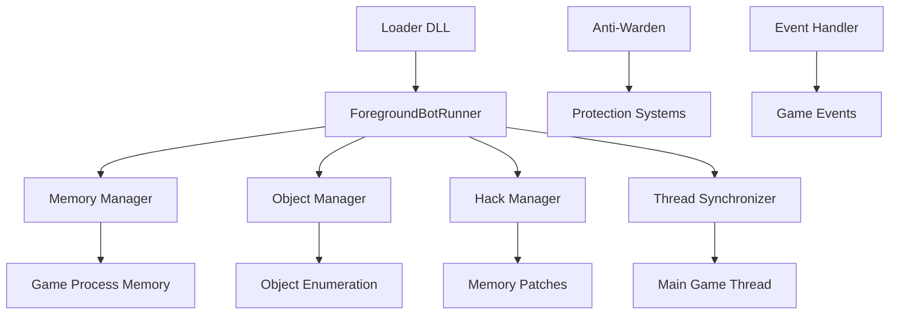

# ForegroundBotRunner

A .NET 8 console application that provides direct memory interaction and foreground automation for World of Warcraft through process injection and memory manipulation. This service enables real-time bot execution with direct game client integration using memory hooks, detours, and anti-detection mechanisms.

## Overview

ForegroundBotRunner is designed as an injectable library that operates directly within the WoW game process. It provides low-level access to game objects, memory manipulation, and direct function calling for advanced bot automation scenarios where network-based solutions are insufficient.

### Key Features

- **Process Injection**: Designed for injection into the WoW game process using the Loader DLL
- **Memory Management**: Direct memory reading/writing with protection mechanisms
- **Object Manager**: Real-time enumeration and management of game objects
- **Anti-Warden**: Protection against Blizzard's anti-cheat detection systems
- **Function Hooking**: Native function detours and calling convention support
- **Thread Synchronization**: Safe execution of operations on the main game thread

## Project Structure

```
ForegroundBotRunner/
??? Mem/                          # Memory management and protection
?   ??? AntiWarden/
?   ?   ??? WardenDisabler.cs     # Anti-cheat protection
?   ??? Hooks/
?   ?   ??? SignalEventManager.cs # Event hooking system
?   ??? HackManager.cs            # Memory patch management
?   ??? Memory.cs                 # Core memory operations
?   ??? MemoryAddresses.cs        # Static memory addresses
?   ??? Offsets.cs                # Dynamic memory offsets
?   ??? Functions.cs              # Native function calls
?   ??? Detour.cs                 # Function detouring
?   ??? Hack.cs                   # Memory hack definitions
?   ??? ThreadSynchronizer.cs     # Main thread synchronization
??? Objects/                      # Game object representations
?   ??? WoWObject.cs              # Base game object
?   ??? LocalPlayer.cs            # Local player implementation
?   ??? LocalPet.cs               # Pet object management
?   ??? WoWPlayer.cs              # Other players
?   ??? WoWUnit.cs                # NPCs and creatures
?   ??? WoWItem.cs                # Item objects
?   ??? WoWContainer.cs           # Bag and container objects
?   ??? WoWGameObject.cs          # Interactive game objects
?   ??? ItemCacheInfo.cs          # Item data caching
??? Statics/                      # Global managers
?   ??? ObjectManager.cs          # Central object enumeration
?   ??? WoWEventHandler.cs        # Game event processing
??? Frames/                       # UI frame management
?   ??? DialogFrame.cs            # Dialog interaction
??? Program.cs                    # Main entry point
??? Loader.cs                     # Thread-safe loader
??? README.md                     # This documentation
```

## Architecture

The ForegroundBotRunner operates through direct memory access and function injection:



## Core Components

### Memory Management
The memory subsystem provides safe access to game process memory:

```csharp
// Example memory operations
var playerHealth = MemoryManager.ReadInt(playerPtr + HealthOffset);
MemoryManager.WriteFloat(playerPtr + FacingOffset, newFacing);
```

### Object Manager
Central hub for game object enumeration and management:

```csharp
public class ObjectManager : IObjectManager
{
    public IWoWLocalPlayer Player { get; private set; }
    public IEnumerable<IWoWObject> Objects { get; }
    public IEnumerable<IWoWUnit> Units { get; }
    public IEnumerable<IWoWPlayer> Players { get; }
    // ... additional collections
}
```

### Hack Manager
Manages memory patches and hooks:

```csharp
internal static class HackManager
{
    static internal void AddHack(Hack hack)
    {
        Console.WriteLine($"[HACK MANAGER] Adding hack {hack.Name}");
        Hacks.Add(hack);
        EnableHack(hack);
    }
}
```

## Dependencies

### NuGet Packages
- **Fasm.NET (1.70.3.2)**: Flat Assembler .NET wrapper for runtime code generation
- **Newtonsoft.Json (13.0.3)**: JSON serialization and configuration
- **System.Memory (4.6.3)**: Advanced memory operations and spans
- **Vcpkg.Nuget (1.5.0)**: Native dependency management

### Project References
- **BotRunner**: Core automation engine integration
- **GameData.Core**: Shared data structures and interfaces

### External Dependencies
- **FastCall.dll**: Native calling convention bridge
- **Fasm.NET.dll**: Runtime assembly generation

### Framework References
- **System.ComponentModel.Composition**: MEF composition for plugin architecture

## Usage

### Process Injection
The ForegroundBotRunner is typically loaded via the Loader DLL:

```cpp
// C++ Loader calls into managed code
int Load(string args)
{
    thread = new Thread(() => {
        Program.Main(args.Split(" "));
    });
    thread.SetApartmentState(ApartmentState.STA);
    thread.Start();
    return 1;
}
```

### Object Enumeration
Access to real-time game objects:

```csharp
// Get all hostile units in range
var hostiles = objectManager.Units
    .Where(u => u.Health > 0)
    .Where(u => u.UnitReaction == UnitReaction.Hostile)
    .Where(u => u.DistanceToPlayer < 30);

// Target and attack
objectManager.SetTarget(hostile.Guid);
objectManager.StartMeleeAttack();
```

### Movement Control
Direct movement through memory manipulation:

```csharp
// Start movement in specific direction
objectManager.StartMovement(ControlBits.Front);

// Set precise facing
objectManager.SetFacing(MathHelper.ToRadians(90));

// Stop all movement
objectManager.StopAllMovement();
```

### Memory Patches
Apply runtime memory modifications:

```csharp
var antiAfkHack = new Hack
{
    Name = "Anti-AFK",
    Address = 0x12345678,
    OriginalBytes = new byte[] { 0x74, 0x08 },
    NewBytes = new byte[] { 0xEB, 0x08 }
};

HackManager.AddHack(antiAfkHack);
```

## Configuration

The project uses compile-time configuration through project properties:

### Build Settings
- **Target Framework**: .NET 8.0
- **Output Type**: Console Application (Exe)
- **Unsafe Blocks**: Enabled for memory operations
- **Base Output Path**: `../../Bot` (shared ecosystem directory)

### Memory Addresses
Static memory addresses are defined in `MemoryAddresses.cs`:

```csharp
public static class MemoryAddresses
{
    public const int LocalPlayerSpellsBase = 0x00C0D788;
    public const int LastHardwareAction = 0x00B4B424;
    public const int ZoneTextPtr = 0x00B42140;
    // ... additional addresses
}
```

## Safety & Anti-Detection

### Anti-Warden System
Protection against Blizzard's anti-cheat mechanisms:

```csharp
// WardenDisabler.cs provides protection against:
// - Memory scan detection
// - Code injection detection  
// - Suspicious API call monitoring
```

### Thread Safety
All game interactions are synchronized to the main thread:

```csharp
ThreadSynchronizer.RunOnMainThread(() =>
{
    // Safe execution of game operations
    var playerPtr = Functions.GetObjectPtr(playerGuid);
    // ... perform operations
});
```

### Memory Protection
Careful memory management to avoid crashes:

```csharp
try
{
    var value = MemoryManager.ReadInt(address);
    return value;
}
catch (Exception)
{
    // Graceful handling of invalid memory access
    return defaultValue;
}
```

## Integration with BloogBot Ecosystem

### StateManager Integration
ForegroundBotRunner is managed by the StateManager service:

```csharp
// StateManager can launch foreground bot instances
// for direct memory access scenarios
public void StartForegroundBotRunner(string accountName)
{
    // Injection and initialization logic
}
```

### BotRunner Coordination
Works alongside BotRunner for hybrid automation:

- **ForegroundBotRunner**: Direct memory access and real-time operations
- **BotRunner**: High-level behavior trees and decision making
- **Communication**: Shared interfaces and data structures

## Development Guidelines

### Memory Safety
- Always validate memory addresses before access
- Use try-catch blocks for memory operations
- Implement proper cleanup and disposal patterns

### Threading
- Use ThreadSynchronizer for main thread operations
- Avoid blocking the main game thread
- Implement proper cancellation tokens

### Error Handling
- Log all exceptions with context
- Graceful degradation on memory access failures
- Comprehensive error recovery mechanisms

## Performance Considerations

### Memory Efficiency
- Minimize memory allocations in hot paths
- Use object pooling for frequently created objects
- Careful management of native resources

### Real-time Operations
- 50ms enumeration cycles for object updates
- Efficient object filtering and querying
- Optimized memory reading patterns

### CPU Usage
- Balanced between responsiveness and CPU usage
- Efficient native function calling
- Minimal overhead on game performance

## Security Considerations

?? **Important Security Notes**:

### Legal Compliance
- This code is for educational and research purposes
- Users must ensure compliance with applicable terms of service
- No warranty provided for detection avoidance

### Process Injection
- Requires elevated privileges for memory access
- May trigger antivirus software warnings
- Should only be used in controlled environments

### Anti-Cheat Awareness
- Anti-Warden system for educational understanding
- Detection methods evolve continuously
- No guarantee of undetectability

## Educational Value

The ForegroundBotRunner serves as a comprehensive example of:

### Advanced Windows Programming
- Process injection and DLL loading
- Memory management and protection
- Native function calling and hooking

### Game Development Concepts
- Object management systems
- Event-driven architectures
- Real-time performance optimization

### Security Research
- Anti-cheat system analysis
- Memory protection mechanisms
- Code injection techniques

## Troubleshooting

### Common Issues

**Injection Failures**:
- Verify target process architecture (x86/x64)
- Check for adequate privileges
- Ensure compatible .NET runtime

**Memory Access Violations**:
- Validate memory addresses for current game version
- Check for proper thread synchronization
- Verify anti-virus interference

**Detection Issues**:
- Review anti-Warden configuration
- Check for signature updates
- Verify memory patch integrity

### Debugging

Enable detailed logging for troubleshooting:

```csharp
// Console output for debugging
Console.WriteLine($"[OBJECT MANAGER] {objectCount} objects enumerated");
Console.WriteLine($"[HACK MANAGER] Adding hack {hack.Name}");
```

## Related Projects

- **[Loader](../../Exports/Loader/README.md)**: Process injection and CLR hosting
- **[FastCall](../../Exports/FastCall/README.md)**: Native function calling bridge
- **[BotRunner](../../Exports/BotRunner/README.md)**: High-level automation engine
- **[StateManager](../StateManager/README.md)**: Multi-bot coordination service
- **[GameData.Core](../../Exports/GameData.Core/README.md)**: Shared data structures

## Contributing

1. **Memory Safety**: Ensure all memory operations are safe and validated
2. **Thread Safety**: Use proper synchronization for main thread operations
3. **Error Handling**: Implement comprehensive exception handling
4. **Documentation**: Document memory addresses and offset meanings
5. **Testing**: Test thoroughly in controlled environments

## License

This project is part of the BloogBot ecosystem. Please refer to the main project license for usage terms.

---

*ForegroundBotRunner provides direct memory access capabilities for advanced World of Warcraft automation scenarios, serving as both a functional tool and educational resource for understanding game process interaction and memory manipulation techniques.*