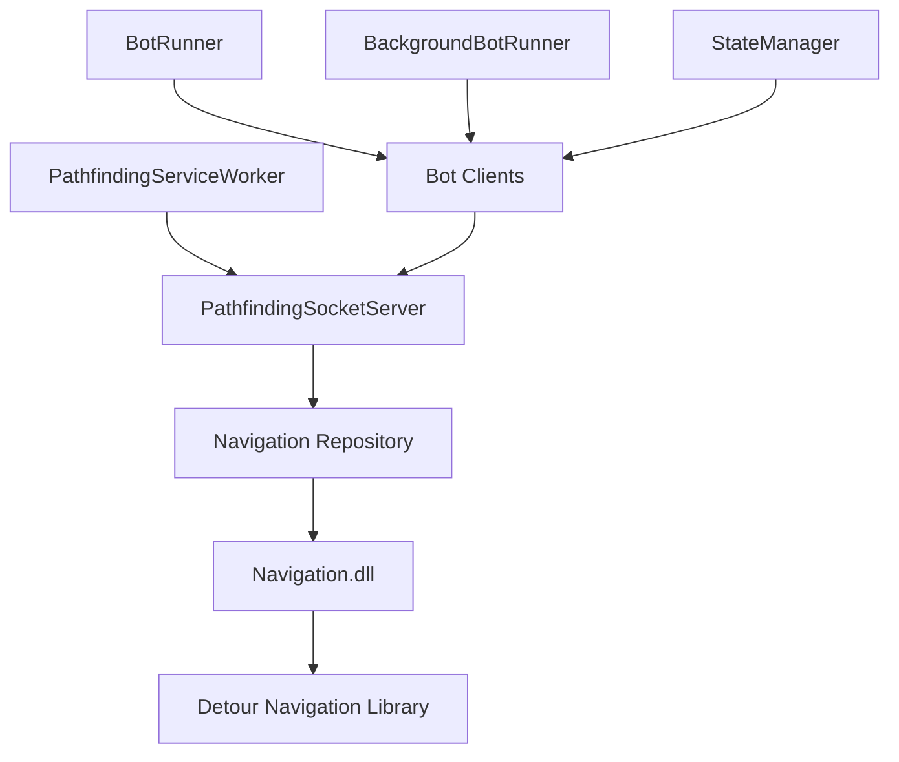

# PathfindingService

A .NET 8 Worker Service that provides navigation pathfinding and physics simulation for the WWoW (Westworld of Warcraft) bot system. This service uses native C++ libraries (Detour/Recast) for efficient navmesh-based pathfinding and WoW-accurate physics calculations.

A high-performance .NET 8 Worker Service that provides advanced pathfinding, navigation, and physics simulation for World of Warcraft bot automation. This service integrates with native C++ navigation libraries to deliver real-time collision detection, line-of-sight calculations, and intelligent pathfinding through the game world.

## Overview

PathfindingService provides:
- **A* Pathfinding**: Navmesh-based path calculation using Detour
- **Physics Simulation**: WoW-accurate character movement physics (gravity, jumping, swimming)
- **Line of Sight**: Raycast-based visibility checks
- **Socket Server**: Protobuf IPC for remote clients (BackgroundBotRunner, ForegroundBotRunner)
PathfindingService is a critical component of the BloogBot ecosystem that handles all spatial navigation requirements. It exposes pathfinding capabilities through a high-performance socket server, allowing multiple bot clients to request navigation data simultaneously without blocking operations.

### Key Features

- **Advanced Pathfinding**: Integration with native C++ Detour navigation library for precise path calculation
- **Real-time Physics**: Character movement simulation with collision detection and environmental interaction
- **Line of Sight**: Fast LOS calculations for tactical positioning and combat decisions  
- **Socket Server Architecture**: High-performance protobuf-based communication for minimal latency
- **Map Pre-loading**: Automatic navigation mesh loading for optimal performance
- **Background Service**: Built on .NET 8 Worker Service framework for reliable 24/7 operation

## Project Structure

```
PathfindingService/
??? PathfindingServiceWorker.cs    # Main background service implementation
??? PathfindingSocketServer.cs     # Protobuf socket server for client communication
??? Program.cs                     # Service host configuration and external launch support
??? Repository/
?   ??? Navigation.cs              # Native C++ library interface and P/Invoke definitions
??? Properties/
?   ??? Resources.resx             # Embedded resources
??? PathfindingService.csproj      # Project configuration
```

## Dependencies

### NuGet Packages
- **Microsoft.Extensions.Hosting (9.0.5)**: Worker Service framework and dependency injection
- **System.Text.Json (9.0.5)**: High-performance JSON serialization

### Project References
- **GameData.Core**: Shared game data models and coordinate systems
- **WinProcessImports**: Windows process interaction utilities

### Native Dependencies
- **Navigation.dll**: C++ navigation library with Detour integration
- **Navigation mesh files**: Pre-computed .mmtile files for each WoW map

## Architecture

```
???????????????????????????????????????????????????????????????????????
?                     PathfindingService                               ?
?                                                                      ?
?  ?????????????????????????????????????????????????????????????????? ?
?  ?              PathfindingServiceWorker (BackgroundService)       ? ?
?  ?                 Main service loop - hosts socket server         ? ?
?  ?????????????????????????????????????????????????????????????????? ?
?                                   ?                                  ?
?  ?????????????????????????????????????????????????????????????????? ?
?  ?              PathfindingSocketServer                            ? ?
?  ?           Protobuf TCP server for IPC requests                  ? ?
?  ?                                                                 ? ?
?  ?   PathfindingRequest ??? HandleRequest() ??? PathfindingResponse? ?
?  ?                              ?                                  ? ?
?  ?        ?????????????????????????????????????????????           ? ?
?  ?        ?                     ?                     ?           ? ?
?  ?        ?                     ?                     ?           ? ?
?  ?  ????????????         ????????????         ????????????       ? ?
?  ?  ?  Path    ?         ?   LoS    ?         ? Physics  ?       ? ?
?  ?  ? Handler  ?         ? Handler  ?         ? Handler  ?       ? ?
?  ?  ????????????         ????????????         ????????????       ? ?
?  ????????????????????????????????????????????????????????????????? ?
?          ?                    ?                    ?                ?
?  ????????????????????????????????????????????????????????????????? ?
?  ?                     Repository Layer                           ? ?
?  ?   ????????????????????       ????????????????????             ? ?
?  ?   ?    Navigation    ?       ?     Physics      ?             ? ?
?  ?   ?  P/Invoke to DLL ?       ?  P/Invoke to DLL ?             ? ?
?  ?   ????????????????????       ????????????????????             ? ?
?  ????????????????????????????????????????????????????????????????? ?
????????????????????????????????????????????????????????????????????????
                ?                          ?
                ?                          ?
        ??????????????????????????????????????????
        ?           Navigation.dll (C++)          ?
        ?  • Detour pathfinding                   ?
        ?  • Recast navmesh loading               ?
        ?  • Physics simulation (collide-slide)   ?
        ?  • Line of sight raycasting             ?
        ??????????????????????????????????????????
                         ?
                         ?
                ????????????????????
                ?   mmaps/*.mmap   ?
                ?   Navigation     ?
                ?   mesh files     ?
                ????????????????????
```
The service operates as a multi-layered architecture:

## Project Structure

```
Services/PathfindingService/
??? PathfindingService.csproj       # .NET 8 Worker Service project
??? Program.cs                       # Host builder entry point
??? PathfindingServiceWorker.cs      # BackgroundService implementation
??? PathfindingSocketServer.cs       # Protobuf socket server + request routing
??? Repository/
?   ??? Navigation.cs                # P/Invoke wrapper for pathfinding
?   ??? Physics.cs                   # P/Invoke wrapper for physics + LoS
??? README.md                        # This documentation
```


## Key Components
## Configuration

### PathfindingServiceWorker
### Service Configuration

The main `BackgroundService` that hosts the socket server:
Configure the pathfinding service in `appsettings.json`:

```csharp
public class PathfindingServiceWorker : BackgroundService
{
    private readonly PathfindingSocketServer _pathfindingSocketServer;
    
    public PathfindingServiceWorker(
        ILogger<PathfindingServiceWorker> logger,
        ILoggerFactory loggerFactory,
        IConfiguration configuration)
    {
        _pathfindingSocketServer = new PathfindingSocketServer(
            configuration["PathfindingService:IpAddress"],
            int.Parse(configuration["PathfindingService:Port"]),
            loggerFactory.CreateLogger<PathfindingSocketServer>()
        );
    }
    
    protected override async Task ExecuteAsync(CancellationToken stoppingToken)
    {
        while (!stoppingToken.IsCancellationRequested)
        {
            await Task.Delay(1000, stoppingToken);
        }
    }
}
```

### PathfindingSocketServer

Handles incoming Protobuf requests and routes to appropriate handlers:

```csharp
public class PathfindingSocketServer : ProtobufSocketServer<PathfindingRequest, PathfindingResponse>
{
    private readonly Navigation _navigation = new();
    private readonly Physics _physics = new();
    
    protected override PathfindingResponse HandleRequest(PathfindingRequest request)
    {
        return request.PayloadCase switch
        {
            PathfindingRequest.PayloadOneofCase.Path => HandlePath(request.Path),
            PathfindingRequest.PayloadOneofCase.Los => HandleLineOfSight(request.Los),
            PathfindingRequest.PayloadOneofCase.Step => HandlePhysics(request.Step),
            _ => ErrorResponse("Unknown request type.")
        };
    }
}
```

### Navigation Repository

P/Invoke wrapper for the native pathfinding library:

```csharp
public class Navigation
{
    [DllImport("Navigation.dll", CallingConvention = CallingConvention.Cdecl)]
    private static extern IntPtr FindPath(uint mapId, XYZ start, XYZ end, bool smoothPath, out int length);
    
    public XYZ[] CalculatePath(uint mapId, XYZ start, XYZ end, bool smoothPath)
    {
        IntPtr pathPtr = FindPath(mapId, start, end, smoothPath, out int length);
        // Marshal path points from native memory...
    }
}
```

### Physics Repository

P/Invoke wrapper for physics simulation and line of sight:

```csharp
public class Physics
{
    [DllImport("Navigation.dll", CallingConvention = CallingConvention.Cdecl)]
    private static extern PhysicsOutput PhysicsStepV2(ref PhysicsInput input);
    
    [DllImport("Navigation.dll", CallingConvention = CallingConvention.Cdecl)]
    private static extern bool LineOfSight(uint mapId, XYZ from, XYZ to);
    
    public PhysicsOutput StepPhysicsV2(PhysicsInput input, float deltaTime)
    {
        input.deltaTime = deltaTime;
        return SanitizeOutput(input, PhysicsStepV2(ref input));
    }
}
```

## Request Types

### CalculatePathRequest

Computes an A* path between two points:

| Field | Type | Description |
|-------|------|-------------|
| `MapId` | uint32 | WoW map ID (0=Eastern Kingdoms, 1=Kalimdor, etc.) |
| `Start` | Position | Starting coordinates (X, Y, Z) |
| `End` | Position | Destination coordinates |
| `Straight` | bool | If true, attempts direct path without navmesh |
```json
{
  "PathfindingService": {
    "IpAddress": "127.0.0.1",
    "Port": 8080
  }
}
```

**Response**: List of `Position` waypoints
### Supported Configuration Options

### LineOfSightRequest
| Setting | Description | Default |
|---------|-------------|---------|
| `IpAddress` | Service bind address | 127.0.0.1 |
| `Port` | Service listen port | 8080 |

Checks visibility between two points:
## API

| Field | Type | Description |
|-------|------|-------------|
| `MapId` | uint32 | WoW map ID |
| `From` | Position | Observer position |
| `To` | Position | Target position |
The service provides three primary operations via protobuf messaging:

**Response**: `InLos` (bool)
### Path Calculation

### PhysicsInput
Calculate optimal paths between two points on a specific map:

Simulates one physics tick for character movement:
```protobuf
message CalculatePathRequest {
  uint32 mapId = 1;
  Position start = 2;
  Position end = 3;
  bool straight = 4;  // Enable path smoothing
}

| Field | Type | Description |
|-------|------|-------------|
| `MapId` | uint32 | Current map |
| `PosX/Y/Z` | float | Current position |
| `VelX/Y/Z` | float | Current velocity |
| `MovementFlags` | uint32 | Movement state flags |
| `WalkSpeed/RunSpeed/SwimSpeed` | float | Movement speeds |
| `Race/Gender` | uint32 | For collision capsule size |
| `DeltaTime` | float | Time step (typically 0.016s) |
message CalculatePathResponse {
  repeated Position corners = 1;
}
```

**Response**: `PhysicsOutput` with new position, velocity, and flags
### Line of Sight

## Configuration
Determine if two positions have unobstructed line of sight:

Configure via `appsettings.json`:
```protobuf
message LineOfSightRequest {
  uint32 mapId = 1;
  Position from = 2;
  Position to = 3;
}

```json
{
  "PathfindingService": {
    "IpAddress": "127.0.0.1",
    "Port": 5000
  }
}
```
message LineOfSightResponse {
  bool inLos = 1;
}
```

## Dependencies
### Physics Simulation

| Package | Version | Purpose |
|---------|---------|---------|
| Microsoft.Extensions.Hosting | 8.0.0 | Worker service hosting |
| Google.Protobuf | 3.27.3 | IPC message serialization |
Step character physics simulation for movement prediction:

```protobuf
message PhysicsInput {
  uint32 moveFlags = 1;
  float x = 2, y = 3, z = 4;
  float orientation = 5;
  float vx = 6, vy = 7, vz = 8;
  // ... additional physics parameters
}

message PhysicsOutput {
  float x = 1, y = 2, z = 3;
  bool isGrounded = 4;
  bool collided = 5;
  float groundZ = 6;
  // ... additional physics results
}
```

## Performance

### Optimization Features

- **Map Pre-loading**: Navigation meshes for Kalimdor (0) and Eastern Kingdoms (1) pre-loaded at startup
- **Native Integration**: Direct P/Invoke to C++ for minimal overhead
- **Memory Management**: Automatic cleanup of native path arrays
- **Async Operations**: Non-blocking socket server with concurrent request handling

### Performance Characteristics

| Operation | Typical Latency | Notes |
|-----------|----------------|-------|
| Path Calculation | 1-5ms | Depends on distance and map complexity |
| Line of Sight | 0.1-1ms | Fast collision ray casting |
| Physics Step | 0.5-2ms | Per-frame movement simulation |

## Client Integration

### C# Client Usage

```csharp
// Using the PathfindingClient from BotRunner
var client = new PathfindingClient("127.0.0.1", 8080);

// Calculate path between two positions
Position[] path = client.GetPath(mapId: 1, start, end, smoothPath: true);

// Check line of sight
bool hasLOS = client.IsInLineOfSight(mapId: 1, from, to);

// Physics simulation step
PhysicsOutput result = client.PhysicsStep(physicsInput);
```

### Service Discovery

The service can be launched externally from other components:

```csharp
// Launch PathfindingService as external process
PathfindingService.Program.LaunchServiceFromCommandLine();
```

## Project References
## Map Support

- **BotCommLayer**: Protobuf message definitions (`PathfindingRequest`, `PathfindingResponse`)
- **GameData.Core**: Shared models (`XYZ`, `Position`, `MovementFlags`, race dimensions)
### Supported Maps

## Native Dependencies
- **Kalimdor (0)**: Complete navigation mesh coverage
- **Eastern Kingdoms (1)**: Complete navigation mesh coverage  
- **Dungeons**: Selected instances with navigation data
- **Custom Maps**: Extensible for additional map support

The service requires `Navigation.dll` (C++) in the output directory:
### Navigation Data Requirements

| Component | Purpose |
|-----------|---------|
| `Navigation.dll` | Detour/Recast pathfinding + physics engine |
| `mmaps/*.mmap` | Precomputed navmesh data per map zone |
Navigation mesh files must be placed in the `mmaps/` directory:
```
mmaps/
??? 000.mmtile  # Kalimdor tiles
??? 001.mmtile  # Eastern Kingdoms tiles
??? ...         # Additional map tiles
```

## Usage Examples
## Error Handling

### Client-Side (via PathfindingClient)
The service provides comprehensive error handling and validation:

```csharp
using BotRunner.Clients;
### Common Error Scenarios

var client = new PathfindingClient("localhost", 5000);
```csharp
// Invalid coordinates
"Position validation failed: coordinates out of bounds"

// Calculate path
var path = await client.CalculatePathAsync(
    mapId: 0,
    start: new Position(100, 200, 50),
    end: new Position(500, 600, 55)
);
// Missing navigation data  
"Navigation mesh not found for map ID: {mapId}"

foreach (var waypoint in path)
{
    Console.WriteLine($"Waypoint: {waypoint.X}, {waypoint.Y}, {waypoint.Z}");
}
// Native library errors
"Path calculation failed: navigation mesh unavailable"
```

// Check line of sight
var hasLos = await client.CheckLineOfSightAsync(
    mapId: 0,
    from: playerPosition,
    to: targetPosition
);
```
### Logging

### Direct Protobuf Request
The service provides detailed logging for debugging and monitoring:

```csharp
var request = new PathfindingRequest
{
    Path = new CalculatePathRequest
    {
        MapId = 0,
        Start = new Position { X = 100, Y = 200, Z = 50 },
        End = new Position { X = 500, Y = 600, Z = 55 },
        Straight = false
    }
};

var response = await client.SendAsync(request);
var waypoints = response.Path.Corners;
```

## Physics Constants

The physics engine uses WoW-accurate constants:

| Constant | Value | Description |
|----------|-------|-------------|
| `GRAVITY` | 19.29 | Gravity (yards/s²) |
| `JUMP_VELOCITY` | 7.96 | Initial jump velocity |
| `STEP_HEIGHT` | 2.125 | Max auto-step height |
| `STEP_DOWN_HEIGHT` | 4.0 | Max ground snap distance |

## Running the Service

### Development

```bash
dotnet run --project Services/PathfindingService
```
```csharp
// Service startup
"Started PathfindingService| 127.0.0.1:8080"

// Request processing
"Path calculated for map {mapId}: {pathLength} waypoints"

// Error conditions
"Navigation error: {errorMessage}"
```

## Development

### Building the Service

```bash
# Build the service
dotnet build PathfindingService.csproj

# Run in development mode
dotnet run --project PathfindingService.csproj
```

### Testing

The service includes comprehensive test coverage in `PathfindingService.Tests`:

```bash
# Run unit tests
dotnet test ../../Tests/PathfindingService.Tests/

# Integration tests with real WoW coordinates
dotnet test --filter Category=Integration
```

### Debugging

Enable detailed logging for development:

```json
{
  "Logging": {
    "LogLevel": {
      "PathfindingService": "Debug",
      "Default": "Information"
    }
  }
}
```

### With Aspire (Orchestrated)
## Deployment

### Worker Service Deployment

The service can be deployed as a Windows Service or Linux daemon:

```bash
# Windows Service installation
sc create PathfindingService binPath="PathfindingService.exe"
sc start PathfindingService

# Linux systemd service
sudo systemctl enable pathfinding.service
sudo systemctl start pathfinding.service
```

### Docker Support

The service supports containerized deployment:

```dockerfile
FROM mcr.microsoft.com/dotnet/aspnet:8.0
COPY . /app
WORKDIR /app
EXPOSE 8080
ENTRYPOINT ["dotnet", "PathfindingService.dll"]
```

## Troubleshooting

### Common Issues

#### Navigation.dll Loading
```
Error: Unable to load Navigation.dll
Solution: Ensure Navigation.dll and dependencies are in the application directory
```

#### Missing Navigation Data
```
Error: Navigation mesh not found for map
Solution: Verify .mmtile files exist in mmaps/ directory
```

#### Port Conflicts
```
Error: Address already in use
Solution: Change port in configuration or stop conflicting service
```

### Performance Issues

The service is registered in `WWoW.Systems.AppHost`:
Monitor service performance using built-in metrics:
- **Request latency**: Average path calculation time
- **Memory usage**: Native heap allocation tracking  
- **Concurrent requests**: Active client connection count

```csharp
var pathfinding = builder.AddProject<Projects.PathfindingService>("pathfinding");
```
## Contributing

### Standalone
When contributing to PathfindingService:

```bash
dotnet publish -c Release -o ./publish
./publish/PathfindingService.exe
```
1. **Performance First**: Maintain sub-5ms path calculation times
2. **Memory Safety**: Properly handle native memory allocation/deallocation
3. **Error Handling**: Comprehensive validation and graceful error recovery
4. **Testing**: Include performance and integration tests
5. **Documentation**: Update API documentation for interface changes

## Consumers
## License

This service is used by:
- **BackgroundBotRunner**: Headless bot navigation
- **ForegroundBotRunner**: In-process bot navigation
- **WoWSharpClient**: Client-side movement prediction
This project integrates with the Detour navigation library and other BloogBot components. Please refer to individual license files for usage terms.

## Related Documentation
## Related Projects

- See `Exports/Navigation/README.md` for native library details
- See `Exports/BotCommLayer/README.md` for IPC protocol
- See `BotRunner/Clients/PathfindingClient.cs` for client implementation
- See `ARCHITECTURE.md` for system overview
- **[Navigation](../../Exports/Navigation/README.md)**: C++ navigation library with Detour integration
- **[BotRunner](../../Exports/BotRunner/README.md)**: Primary consumer of pathfinding services
- **[StateManager](../StateManager/README.md)**: Multi-bot coordination requiring pathfinding
- **[GameData.Core](../../Exports/GameData.Core/README.md)**: Shared coordinate and position models
- **[BackgroundBotRunner](../BackgroundBotRunner/README.md)**: Background automation using pathfinding

---

*This component is part of the WWoW (Westworld of Warcraft) simulation platform.*
*PathfindingService provides the spatial intelligence foundation for the BloogBot ecosystem, enabling sophisticated navigation and movement simulation for World of Warcraft automation.*