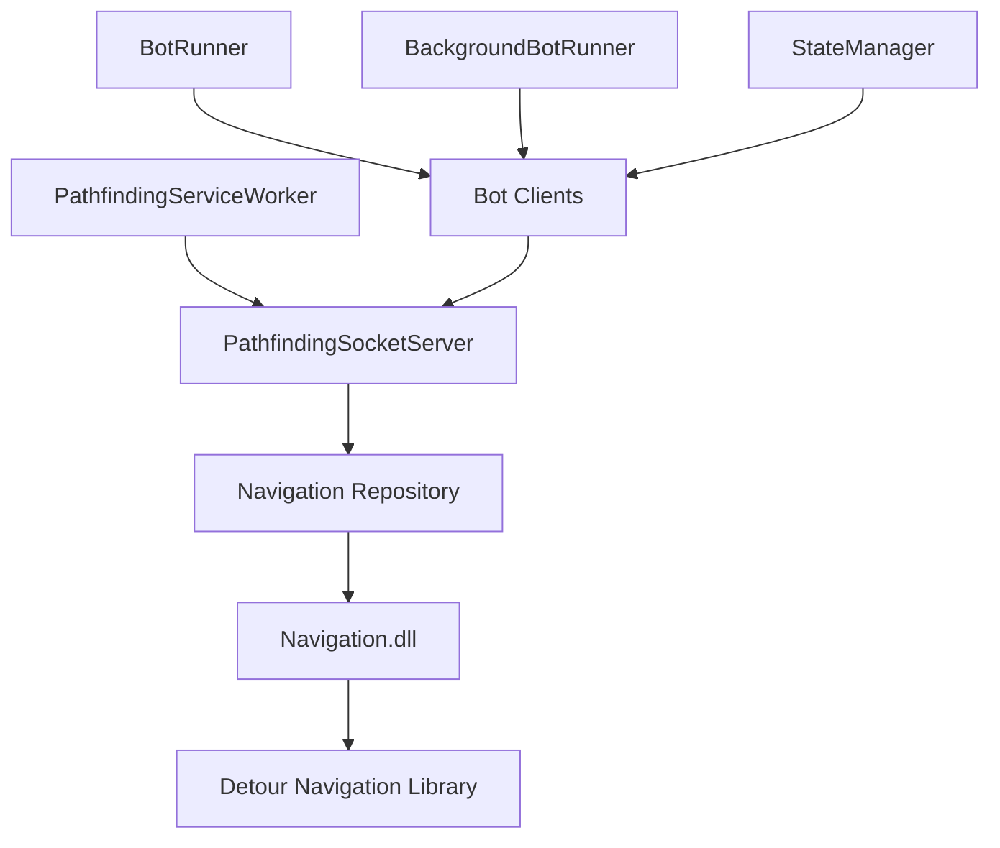

# PathfindingService

A high-performance .NET 8 Worker Service that provides advanced pathfinding, navigation, and physics simulation for World of Warcraft bot automation. This service integrates with native C++ navigation libraries to deliver real-time collision detection, line-of-sight calculations, and intelligent pathfinding through the game world.

## Overview

PathfindingService is a critical component of the BloogBot ecosystem that handles all spatial navigation requirements. It exposes pathfinding capabilities through a high-performance socket server, allowing multiple bot clients to request navigation data simultaneously without blocking operations.

### Key Features

- **Advanced Pathfinding**: Integration with native C++ Detour navigation library for precise path calculation
- **Real-time Physics**: Character movement simulation with collision detection and environmental interaction
- **Line of Sight**: Fast LOS calculations for tactical positioning and combat decisions  
- **Socket Server Architecture**: High-performance protobuf-based communication for minimal latency
- **Map Pre-loading**: Automatic navigation mesh loading for optimal performance
- **Background Service**: Built on .NET 8 Worker Service framework for reliable 24/7 operation

## Project Structure

```
PathfindingService/
??? PathfindingServiceWorker.cs    # Main background service implementation
??? PathfindingSocketServer.cs     # Protobuf socket server for client communication
??? Program.cs                     # Service host configuration and external launch support
??? Repository/
?   ??? Navigation.cs              # Native C++ library interface and P/Invoke definitions
??? Properties/
?   ??? Resources.resx             # Embedded resources
??? PathfindingService.csproj      # Project configuration
```

## Dependencies

### NuGet Packages
- **Microsoft.Extensions.Hosting (9.0.5)**: Worker Service framework and dependency injection
- **System.Text.Json (9.0.5)**: High-performance JSON serialization

### Project References
- **GameData.Core**: Shared game data models and coordinate systems
- **WinProcessImports**: Windows process interaction utilities

### Native Dependencies
- **Navigation.dll**: C++ navigation library with Detour integration
- **Navigation mesh files**: Pre-computed .mmtile files for each WoW map

## Architecture

The service operates as a multi-layered architecture:



## Configuration

### Service Configuration

Configure the pathfinding service in `appsettings.json`:

```json
{
  "PathfindingService": {
    "IpAddress": "127.0.0.1",
    "Port": 8080
  }
}
```

### Supported Configuration Options

| Setting | Description | Default |
|---------|-------------|---------|
| `IpAddress` | Service bind address | 127.0.0.1 |
| `Port` | Service listen port | 8080 |

## API

The service provides three primary operations via protobuf messaging:

### Path Calculation

Calculate optimal paths between two points on a specific map:

```protobuf
message CalculatePathRequest {
  uint32 mapId = 1;
  Position start = 2;
  Position end = 3;
  bool straight = 4;  // Enable path smoothing
}

message CalculatePathResponse {
  repeated Position corners = 1;
}
```

### Line of Sight

Determine if two positions have unobstructed line of sight:

```protobuf
message LineOfSightRequest {
  uint32 mapId = 1;
  Position from = 2;
  Position to = 3;
}

message LineOfSightResponse {
  bool inLos = 1;
}
```

### Physics Simulation

Step character physics simulation for movement prediction:

```protobuf
message PhysicsInput {
  uint32 moveFlags = 1;
  float x = 2, y = 3, z = 4;
  float orientation = 5;
  float vx = 6, vy = 7, vz = 8;
  // ... additional physics parameters
}

message PhysicsOutput {
  float x = 1, y = 2, z = 3;
  bool isGrounded = 4;
  bool collided = 5;
  float groundZ = 6;
  // ... additional physics results
}
```

## Performance

### Optimization Features

- **Map Pre-loading**: Navigation meshes for Kalimdor (0) and Eastern Kingdoms (1) pre-loaded at startup
- **Native Integration**: Direct P/Invoke to C++ for minimal overhead
- **Memory Management**: Automatic cleanup of native path arrays
- **Async Operations**: Non-blocking socket server with concurrent request handling

### Performance Characteristics

| Operation | Typical Latency | Notes |
|-----------|----------------|-------|
| Path Calculation | 1-5ms | Depends on distance and map complexity |
| Line of Sight | 0.1-1ms | Fast collision ray casting |
| Physics Step | 0.5-2ms | Per-frame movement simulation |

## Client Integration

### C# Client Usage

```csharp
// Using the PathfindingClient from BotRunner
var client = new PathfindingClient("127.0.0.1", 8080);

// Calculate path between two positions
Position[] path = client.GetPath(mapId: 1, start, end, smoothPath: true);

// Check line of sight
bool hasLOS = client.IsInLineOfSight(mapId: 1, from, to);

// Physics simulation step
PhysicsOutput result = client.PhysicsStep(physicsInput);
```

### Service Discovery

The service can be launched externally from other components:

```csharp
// Launch PathfindingService as external process
PathfindingService.Program.LaunchServiceFromCommandLine();
```

## Map Support

### Supported Maps

- **Kalimdor (0)**: Complete navigation mesh coverage
- **Eastern Kingdoms (1)**: Complete navigation mesh coverage  
- **Dungeons**: Selected instances with navigation data
- **Custom Maps**: Extensible for additional map support

### Navigation Data Requirements

Navigation mesh files must be placed in the `mmaps/` directory:
```
mmaps/
??? 000.mmtile  # Kalimdor tiles
??? 001.mmtile  # Eastern Kingdoms tiles
??? ...         # Additional map tiles
```

## Error Handling

The service provides comprehensive error handling and validation:

### Common Error Scenarios

```csharp
// Invalid coordinates
"Position validation failed: coordinates out of bounds"

// Missing navigation data  
"Navigation mesh not found for map ID: {mapId}"

// Native library errors
"Path calculation failed: navigation mesh unavailable"
```

### Logging

The service provides detailed logging for debugging and monitoring:

```csharp
// Service startup
"Started PathfindingService| 127.0.0.1:8080"

// Request processing
"Path calculated for map {mapId}: {pathLength} waypoints"

// Error conditions
"Navigation error: {errorMessage}"
```

## Development

### Building the Service

```bash
# Build the service
dotnet build PathfindingService.csproj

# Run in development mode
dotnet run --project PathfindingService.csproj
```

### Testing

The service includes comprehensive test coverage in `PathfindingService.Tests`:

```bash
# Run unit tests
dotnet test ../../Tests/PathfindingService.Tests/

# Integration tests with real WoW coordinates
dotnet test --filter Category=Integration
```

### Debugging

Enable detailed logging for development:

```json
{
  "Logging": {
    "LogLevel": {
      "PathfindingService": "Debug",
      "Default": "Information"
    }
  }
}
```

## Deployment

### Worker Service Deployment

The service can be deployed as a Windows Service or Linux daemon:

```bash
# Windows Service installation
sc create PathfindingService binPath="PathfindingService.exe"
sc start PathfindingService

# Linux systemd service
sudo systemctl enable pathfinding.service
sudo systemctl start pathfinding.service
```

### Docker Support

The service supports containerized deployment:

```dockerfile
FROM mcr.microsoft.com/dotnet/aspnet:8.0
COPY . /app
WORKDIR /app
EXPOSE 8080
ENTRYPOINT ["dotnet", "PathfindingService.dll"]
```

## Troubleshooting

### Common Issues

#### Navigation.dll Loading
```
Error: Unable to load Navigation.dll
Solution: Ensure Navigation.dll and dependencies are in the application directory
```

#### Missing Navigation Data
```
Error: Navigation mesh not found for map
Solution: Verify .mmtile files exist in mmaps/ directory
```

#### Port Conflicts
```
Error: Address already in use
Solution: Change port in configuration or stop conflicting service
```

### Performance Issues

Monitor service performance using built-in metrics:
- **Request latency**: Average path calculation time
- **Memory usage**: Native heap allocation tracking  
- **Concurrent requests**: Active client connection count

## Contributing

When contributing to PathfindingService:

1. **Performance First**: Maintain sub-5ms path calculation times
2. **Memory Safety**: Properly handle native memory allocation/deallocation
3. **Error Handling**: Comprehensive validation and graceful error recovery
4. **Testing**: Include performance and integration tests
5. **Documentation**: Update API documentation for interface changes

## License

This project integrates with the Detour navigation library and other BloogBot components. Please refer to individual license files for usage terms.

## Related Projects

- **[Navigation](../../Exports/Navigation/README.md)**: C++ navigation library with Detour integration
- **[BotRunner](../../Exports/BotRunner/README.md)**: Primary consumer of pathfinding services
- **[StateManager](../StateManager/README.md)**: Multi-bot coordination requiring pathfinding
- **[GameData.Core](../../Exports/GameData.Core/README.md)**: Shared coordinate and position models
- **[BackgroundBotRunner](../BackgroundBotRunner/README.md)**: Background automation using pathfinding

---

*PathfindingService provides the spatial intelligence foundation for the BloogBot ecosystem, enabling sophisticated navigation and movement simulation for World of Warcraft automation.*