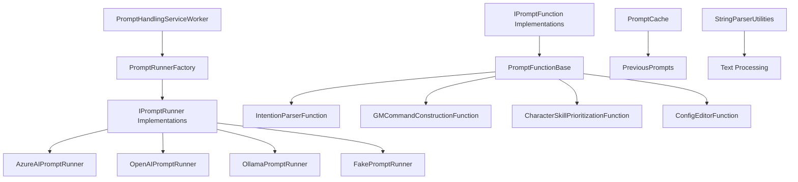

# PromptHandlingService

A powerful AI prompt processing service for BloogBot that provides intelligent automation capabilities through multiple AI providers. This service serves as the brain of the bot ecosystem, enabling natural language understanding and intelligent decision making.

## Overview

PromptHandlingService is a .NET 8 Worker Service that integrates with various AI providers (Azure OpenAI, OpenAI, Ollama) to process prompts and generate intelligent responses. It provides a flexible framework for creating specialized prompt functions that can handle different aspects of World of Warcraft automation.

## Key Features

### Multi-Provider AI Support
- **Azure OpenAI**: Enterprise-grade AI with Azure integration
- **OpenAI**: Direct OpenAI API access with GPT models
- **Ollama**: Local AI model execution for privacy and offline use
- **Fake Provider**: Testing and development mock provider

### Specialized Prompt Functions
- **Intent Parser**: Analyzes user requests and routes them to appropriate handlers
- **GM Command Constructor**: Generates game master commands for server administration
- **Character Skill Prioritizer**: Determines optimal skill progression for characters
- **Config Editor**: Handles MaNGOS server configuration modifications

### Intelligent Caching
- **Prompt Cache**: Stores and retrieves previous prompt results for efficiency
- **Chat History Management**: Maintains conversation context across sessions
- **JSON and Text Export**: Save conversations for analysis and debugging

### Advanced Utilities
- **String Parsing**: Extract content from markdown code blocks and structured text
- **SQL Parser**: Handle database table definitions and queries
- **List Processing**: Parse bulleted and structured lists

## Architecture

### Core Components



### Provider Factory Pattern

The service uses a factory pattern to create appropriate AI providers:

```csharp
// Create different provider types
var azureRunner = PromptRunnerFactory.GetAzureOpenAiPromptRunner(baseUri, apiKey);
var ollamaRunner = PromptRunnerFactory.GetOllamaPromptRunner(baseUri, model);
var openAiRunner = PromptRunnerFactory.GetOpenAiPromptRunner(client, deploymentName);
```

## Quick Start

### Basic Prompt Function Implementation

```csharp
public class MyCustomFunction : PromptFunctionBase
{
    public MyCustomFunction(IPromptRunner promptRunner) : base(promptRunner) { }
    
    protected override string SystemPrompt => 
        "You are a helpful World of Warcraft assistant...";
    
    public override async Task CompleteAsync(CancellationToken cancellationToken)
    {
        var response = await RunChatAsync("Your prompt here", cancellationToken);
        // Process response...
    }
}
```

### Using the Intent Parser

```csharp
var ollamaRunner = new OllamaPromptRunner(uri, "llama3");
var request = new IntentionParserFunction.UserRequest 
{ 
    Request = "Can you teleport me to Orgrimmar?" 
};

var result = await IntentionParserFunction.ParsePromptIntent(
    ollamaRunner, request, cancellationToken);
// Result: "Send to DataQueryRunner: Fetch teleport command for Orgrimmar"
```

### Character Skill Prioritization

```csharp
var description = new CharacterSkillPrioritizationFunction.CharacterDescription
{
    ClassName = "Warrior",
    Race = "Human",
    Level = 25,
    Skills = ["Swords", "Defense", "Mining", "Blacksmithing"]
};

var prioritizedSkill = await CharacterSkillPrioritizationFunction
    .GetPrioritizedCharacterSkill(promptRunner, description, cancellationToken);
// Result: "Defense" (based on AI analysis)
```

## Dependencies

### NuGet Packages
- **Azure.AI.OpenAI** (1.0.0-beta.17): Azure OpenAI integration
- **Newtonsoft.Json** (13.0.3): JSON serialization and parsing
- **OllamaSharp** (3.0.4): Local Ollama model integration
- **SQLite** (3.13.0): Database functionality
- **sqlite-net-pcl** (1.9.172): SQLite .NET integration

### Project References
- **BotCommLayer**: Communication infrastructure for service coordination

## Configuration

### AI Provider Configuration

The service supports multiple AI providers that can be configured through dependency injection:

```csharp
// Azure OpenAI
services.AddSingleton<IPromptRunner>(provider =>
    PromptRunnerFactory.GetAzureOpenAiPromptRunner(azureUri, apiKey));

// Local Ollama
services.AddSingleton<IPromptRunner>(provider =>
    PromptRunnerFactory.GetOllamaPromptRunner(ollamaUri, "llama3"));
```

### Worker Service Integration

The service integrates with the StateManager as a hosted service:

```csharp
services.AddHostedService<PromptHandlingServiceWorker>();
```

## Advanced Features

### Chat History Management

Prompt functions maintain conversation context and can transfer history between functions:

```csharp
public void TransferHistory(IPromptFunction transferTarget)
{
    // Transfer conversation context to another function
    sourceFunction.TransferHistory(targetFunction);
}
```

### Parameter Management

Type-safe parameter handling with compile-time names:

```csharp
// Set parameters
SetParameter<string>(value: "MyValue"); // Uses caller member name
SetParameter<int>("CustomName", 42);

// Get parameters
var value = GetParameter<string>(); // Uses caller member name
var custom = GetParameter<int>("CustomName");
```

### Chat Persistence

Save conversations for debugging and analysis:

```csharp
await promptFunction.SaveChat(
    directoryPath: @"C:\ChatLogs", 
    filePath: "conversation.txt",
    cancellationToken);
// Saves both .txt and .json versions
```

## Testing

### Unit Test Example

```csharp
[Test]
public async Task ParsePromptIntent_GameMechanics_ReturnsCorrectHandler()
{
    // Arrange
    var ollamaRunner = new OllamaPromptRunner(_ollamaUri, "llama3");
    var request = new IntentionParserFunction.UserRequest
    {
        Request = "How does threat work in World of Warcraft?"
    };

    // Act
    var result = await IntentionParserFunction.ParsePromptIntent(
        ollamaRunner, request, CancellationToken.None);

    // Assert
    Assert.Equal("Send to MechanicsExplainerRunner: Explain how threat works", result);
}
```

## Integration with BloogBot Ecosystem

### Service Communication
The PromptHandlingService integrates with other BloogBot services through:
- **StateManager**: Central coordination and service orchestration
- **BotCommLayer**: Protocol Buffers messaging for distributed communication
- **BackgroundBotRunner**: AI-driven bot decision making

### Use Cases in Bot Automation
- **Natural Language Commands**: Process user requests in natural language
- **Dynamic Strategy Adaptation**: Analyze game state and adapt strategies
- **Configuration Management**: Generate and modify server configurations
- **Decision Support**: Provide intelligent recommendations for bot actions

## Performance Considerations

### Concurrency Limits
Different providers have varying concurrency capabilities:
- **Azure OpenAI**: 50 concurrent requests
- **OpenAI**: 50 concurrent requests  
- **Ollama**: 1 concurrent request (local processing)
- **Fake Provider**: Unlimited (testing only)

### Memory Management
- Automatic disposal of AI clients
- Efficient chat history management
- Configurable caching strategies

## Error Handling

The service provides robust error handling:

```csharp
try
{
    var result = await promptRunner.RunChatAsync(chatHistory, cancellationToken);
    return result;
}
catch (OllamaException ex)
{
    return $"Ollama API Error: {ex.Message}";
}
catch (Exception ex)
{
    return $"Unexpected error: {ex.Message}";
}
```

## Security Considerations

### API Key Management
- Use secure configuration providers
- Avoid hardcoding credentials
- Implement proper key rotation

### Local AI Processing
- Ollama provider keeps data local
- No external API calls for sensitive data
- Full control over model execution

## Troubleshooting

### Common Issues

**Ollama Connection Failures**:
- Verify Ollama service is running
- Check URI configuration
- Ensure model is downloaded locally

**Azure OpenAI Rate Limits**:
- Implement exponential backoff
- Monitor quota usage
- Consider request batching

**Memory Issues with Large Conversations**:
- Implement chat history pruning
- Use streaming responses when available
- Monitor memory usage patterns

## Future Enhancements

### Planned Features
- **Vector Database Integration**: Semantic search and retrieval
- **Multi-Modal Support**: Image and audio processing capabilities
- **Advanced Caching**: Intelligent prompt result caching
- **Plugin Architecture**: Dynamic prompt function loading

### Extensibility Points
- Custom prompt function implementations
- Additional AI provider integrations
- Enhanced parameter validation
- Advanced conversation management

## Related Projects

- **[StateManager](../StateManager/README.md)**: Service orchestration and coordination
- **[BotCommLayer](../../Exports/BotCommLayer/README.md)**: Inter-service communication
- **[BackgroundBotRunner](../BackgroundBotRunner/README.md)**: AI-driven bot automation
- **[DecisionEngineService](../DecisionEngineService/README.md)**: Strategic decision making

## Contributing

### Development Guidelines
1. **Prompt Functions**: Inherit from `PromptFunctionBase` for consistency
2. **Error Handling**: Implement comprehensive exception handling
3. **Testing**: Include unit tests for all prompt functions
4. **Documentation**: Document system prompts and expected outputs
5. **Performance**: Consider token limits and response times

### Code Style
- Follow .NET 8 conventions with nullable reference types
- Use implicit usings for common namespaces
- Implement proper async/await patterns
- Include XML documentation for public APIs

## License

This project is part of the BloogBot ecosystem. Please refer to the main project license for usage terms.

---

*PromptHandlingService provides the AI intelligence layer for the BloogBot ecosystem, enabling natural language processing, intelligent decision making, and automated content generation for World of Warcraft automation scenarios.*