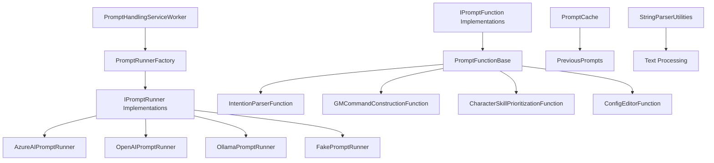

# PromptHandlingService

A .NET 8 Worker Service that provides AI/LLM prompt execution capabilities for the WWoW (Westworld of Warcraft) bot system. This service abstracts multiple AI provider backends (Azure AI, OpenAI, Ollama) and provides reusable prompt functions for bot decision-making.
A powerful AI prompt processing service for BloogBot that provides intelligent automation capabilities through multiple AI providers. This service serves as the brain of the bot ecosystem, enabling natural language understanding and intelligent decision making.

## Overview

PromptHandlingService provides:
- **Multi-Provider Support**: Azure AI, OpenAI, Ollama, and a Fake provider for testing
- **Prompt Functions**: Reusable, composable AI prompt templates
- **Response Caching**: Reduces API calls for repeated queries
- **Intent Parsing**: Natural language to structured command conversion
- **GM Commands**: AI-assisted game master command construction
PromptHandlingService is a .NET 8 Worker Service that integrates with various AI providers (Azure OpenAI, OpenAI, Ollama) to process prompts and generate intelligent responses. It provides a flexible framework for creating specialized prompt functions that can handle different aspects of World of Warcraft automation.

## Architecture
## Key Features

```
???????????????????????????????????????????????????????????????????????
?                     PromptHandlingService                            ?
?                                                                      ?
?  ?????????????????????????????????????????????????????????????????? ?
?  ?           PromptHandlingServiceWorker (BackgroundService)       ? ?
?  ?                      Main service host                          ? ?
?  ?????????????????????????????????????????????????????????????????? ?
?                                   ?                                  ?
?  ?????????????????????????????????????????????????????????????????? ?
?  ?                     PromptRunnerFactory                         ? ?
?  ?              Creates appropriate IPromptRunner instance         ? ?
?  ?????????????????????????????????????????????????????????????????? ?
?                                   ?                                  ?
?     ?????????????????????????????????????????????????????????????   ?
?     ?             ?               ?               ?             ?   ?
?  ?????????   ???????????   ????????????   ??????????????       ?   ?
?  ?Azure  ?   ? OpenAI  ?   ?  Ollama  ?   ?   Fake     ?       ?   ?
?  ?  AI   ?   ? Runner  ?   ?  Runner  ?   ?  Runner    ?       ?   ?
?  ?Runner ?   ?         ?   ?          ?   ? (Testing)  ?       ?   ?
?  ?????????   ???????????   ????????????   ??????????????       ?   ?
?                                                                      ?
?  ?????????????????????????????????????????????????????????????????? ?
?  ?                    Predefined Prompt Functions                  ? ?
?  ?  ????????????????  ????????????????  ????????????????         ? ?
?  ?  ?IntentParser  ?  ? GMCommand    ?  ? ConfigEditor ?         ? ?
?  ?  ?  Function    ?  ? Constructor  ?  ?   Function   ?         ? ?
?  ?  ????????????????  ????????????????  ????????????????         ? ?
?  ?  ????????????????                                              ? ?
?  ?  ?CharacterSkill?                                              ? ?
?  ?  ?Prioritization?                                              ? ?
?  ?  ????????????????                                              ? ?
?  ?????????????????????????????????????????????????????????????????? ?
?                                                                      ?
?  ?????????????????????????????????????????????????????????????????? ?
?  ?                       PromptCache                               ? ?
?  ?                Caches responses to reduce API calls             ? ?
?  ?????????????????????????????????????????????????????????????????? ?
????????????????????????????????????????????????????????????????????????
```
### Multi-Provider AI Support
- **Azure OpenAI**: Enterprise-grade AI with Azure integration
- **OpenAI**: Direct OpenAI API access with GPT models
- **Ollama**: Local AI model execution for privacy and offline use
- **Fake Provider**: Testing and development mock provider

## Project Structure
### Specialized Prompt Functions
- **Intent Parser**: Analyzes user requests and routes them to appropriate handlers
- **GM Command Constructor**: Generates game master commands for server administration
- **Character Skill Prioritizer**: Determines optimal skill progression for characters
- **Config Editor**: Handles MaNGOS server configuration modifications

```
Services/PromptHandlingService/
??? PromptHandlingService.csproj        # .NET 8 Worker Service project
??? PromptHandlingServiceWorker.cs      # BackgroundService implementation
??? IPromptRunner.cs                    # Provider abstraction interface
??? IPromptFunction.cs                  # Prompt function interface
??? PromptFunctionBase.cs               # Base class for prompt functions
??? PromptRunnerFactory.cs              # Factory for creating runners
??? Providers/
?   ??? AzureAIPromptRunner.cs          # Azure AI endpoint integration
?   ??? OpenAIPromptRunner.cs           # OpenAI API integration
?   ??? OllamaPromptRunner.cs           # Local Ollama integration
?   ??? FakePromptRunner.cs             # Mock runner for testing
??? Predefined/
?   ??? IntentParser/
?   ?   ??? IntentionParserFunction.cs  # NL ? structured intent
?   ??? GMCommands/
?   ?   ??? GMCommandConstructionFunction.cs
?   ??? MaNGOSConfigHandlers/
?   ?   ??? ConfigEditorFunction.cs
?   ??? CharacterSkills/
?       ??? CharacterSkillPrioritizationFunction.cs
??? Cache/
?   ??? PromptCache.cs                  # Response caching
?   ??? Models/
?       ??? PreviousPrompts.cs          # Cache entry model
??? Utilities/
?   ??? StringParserUtilities.cs        # Response parsing helpers
??? README.md                           # This documentation
```
### Intelligent Caching
- **Prompt Cache**: Stores and retrieves previous prompt results for efficiency
- **Chat History Management**: Maintains conversation context across sessions
- **JSON and Text Export**: Save conversations for analysis and debugging

## Key Components
### Advanced Utilities
- **String Parsing**: Extract content from markdown code blocks and structured text
- **SQL Parser**: Handle database table definitions and queries
- **List Processing**: Parse bulleted and structured lists

### IPromptRunner Interface
## Architecture

The core abstraction for AI providers:
### Core Components

```csharp
public interface IPromptRunner : IDisposable
{
    /// <summary>
    /// Runs a chat completion with the given history.
    /// </summary>
    /// <param name="chatHistory">Messages as role/content pairs</param>
    /// <param name="cancellationToken">Cancellation token</param>
    /// <returns>The assistant's response</returns>
    Task<string?> RunChatAsync(
        IEnumerable<KeyValuePair<string, string?>> chatHistory,
        CancellationToken cancellationToken);
    
    /// <summary>
    /// Maximum concurrent requests supported by this provider.
    /// </summary>
    int MaxConcurrent { get; }
}
```

### Prompt Providers


#### AzureAIPromptRunner
### Provider Factory Pattern

Connects to Azure AI endpoints (Azure OpenAI, Azure ML):
The service uses a factory pattern to create appropriate AI providers:

```csharp
var runner = new AzureAIPromptRunner(
    baseAddress: new Uri("https://your-endpoint.openai.azure.com/"),
    apiKey: "your-api-key"
);
```csharp
// Create different provider types
var azureRunner = PromptRunnerFactory.GetAzureOpenAiPromptRunner(baseUri, apiKey);
var ollamaRunner = PromptRunnerFactory.GetOllamaPromptRunner(baseUri, model);
var openAiRunner = PromptRunnerFactory.GetOpenAiPromptRunner(client, deploymentName);
```

var response = await runner.RunChatAsync(new[]
{
    KeyValuePair.Create("system", "You are a WoW bot assistant."),
    KeyValuePair.Create("user", "What spell should I cast next?")
}, cancellationToken);
```
## Quick Start

#### OllamaPromptRunner
### Basic Prompt Function Implementation

Connects to local Ollama instance for self-hosted models:

```csharp
var runner = new OllamaPromptRunner(
    baseAddress: new Uri("http://localhost:11434/"),
    modelName: "llama2"
);
```

#### FakePromptRunner

Returns predefined responses for testing without API calls:

```csharp
var runner = new FakePromptRunner();
// Returns mock responses for testing prompt functions
```

### Predefined Prompt Functions

#### IntentionParserFunction

Converts natural language commands into structured intents:

```csharp
// Input: "Go grind murlocs near Goldshire"
// Output: { Intent: "Grind", Target: "Murloc", Location: "Goldshire" }
```

#### GMCommandConstructionFunction

Generates MaNGOS GM commands from natural language:

```csharp
// Input: "Give me 100 gold"
// Output: ".modify money 1000000"
```

#### CharacterSkillPrioritizationFunction

Determines skill usage priority based on class and situation:

```csharp
// Input: Current game state (health, mana, targets, etc.)
// Output: Ordered list of skills to use
```

### PromptCache

Caches responses to reduce API calls for repeated queries:

```csharp
public class PromptCache
public class MyCustomFunction : PromptFunctionBase
{
    public bool TryGetCachedResponse(string prompt, out string? response);
    public void CacheResponse(string prompt, string response);
}
```

## Configuration

Configure via `appsettings.json`:

```json
{
  "PromptHandling": {
    "Provider": "AzureAI",
    "AzureAI": {
      "Endpoint": "https://your-endpoint.openai.azure.com/",
      "ApiKey": "your-api-key",
      "DeploymentName": "gpt-4"
    },
    "OpenAI": {
      "ApiKey": "sk-your-key",
      "Model": "gpt-4"
    },
    "Ollama": {
      "BaseUrl": "http://localhost:11434/",
      "Model": "llama2"
    },
    "Cache": {
      "Enabled": true,
      "MaxEntries": 1000,
      "ExpirationMinutes": 60
    }
  }
    public MyCustomFunction(IPromptRunner promptRunner) : base(promptRunner) { }
    
    protected override string SystemPrompt => 
        "You are a helpful World of Warcraft assistant...";
    
    public override async Task CompleteAsync(CancellationToken cancellationToken)
    {
        var response = await RunChatAsync("Your prompt here", cancellationToken);
        // Process response...
    }
}
```

## Dependencies

| Package | Version | Purpose |
|---------|---------|---------|
| Microsoft.Extensions.Hosting | 8.0.0 | Worker service hosting |
| System.Text.Json | - | JSON serialization for API requests |

## Usage Examples

### Basic Chat Completion

```csharp
// Create runner
var runner = new AzureAIPromptRunner(endpoint, apiKey);
### Using the Intent Parser

// Build chat history
var messages = new List<KeyValuePair<string, string?>>
{
    KeyValuePair.Create("system", "You are a WoW combat advisor."),
    KeyValuePair.Create("user", "I'm a level 30 warrior with low health, facing 2 murlocs. What should I do?")
};
```csharp
var ollamaRunner = new OllamaPromptRunner(uri, "llama3");
var request = new IntentionParserFunction.UserRequest 
{ 
    Request = "Can you teleport me to Orgrimmar?" 
};

// Get response
var response = await runner.RunChatAsync(messages, cancellationToken);
Console.WriteLine(response);
// Output: "Use Intimidating Shout to fear the murlocs, then bandage or use a health potion..."
```
var result = await IntentionParserFunction.ParsePromptIntent(
    ollamaRunner, request, cancellationToken);
// Result: "Send to DataQueryRunner: Fetch teleport command for Orgrimmar"
```

### Using Prompt Functions
### Character Skill Prioritization

```csharp
// Create a prompt function
var intentParser = new IntentionParserFunction(runner);
```csharp
var description = new CharacterSkillPrioritizationFunction.CharacterDescription
{
    ClassName = "Warrior",
    Race = "Human",
    Level = 25,
    Skills = ["Swords", "Defense", "Mining", "Blacksmithing"]
};

// Parse user intent
var intent = await intentParser.ParseAsync("Go kill wolves in Elwynn Forest");
// Returns structured intent object
var prioritizedSkill = await CharacterSkillPrioritizationFunction
    .GetPrioritizedCharacterSkill(promptRunner, description, cancellationToken);
// Result: "Defense" (based on AI analysis)
```

// Use with decision engine
var gmCommand = new GMCommandConstructionFunction(runner);
var command = await gmCommand.GenerateAsync("teleport me to Stormwind");
// Returns: ".tele Stormwind"
```
## Dependencies

### With Caching
### NuGet Packages
- **Azure.AI.OpenAI** (1.0.0-beta.17): Azure OpenAI integration
- **Newtonsoft.Json** (13.0.3): JSON serialization and parsing
- **OllamaSharp** (3.0.4): Local Ollama model integration
- **SQLite** (3.13.0): Database functionality
- **sqlite-net-pcl** (1.9.172): SQLite .NET integration

```csharp
var cache = new PromptCache();

// Check cache first
if (!cache.TryGetCachedResponse(prompt, out var response))
{
    response = await runner.RunChatAsync(messages, cancellationToken);
    cache.CacheResponse(prompt, response);
}
```

## Provider Comparison

| Provider | Latency | Cost | Offline | Best For |
|----------|---------|------|---------|----------|
| Azure AI | Low | $$$ | No | Production, enterprise |
| OpenAI | Low | $$$ | No | General use |
| Ollama | Medium | Free | Yes | Development, privacy |
| Fake | None | Free | Yes | Testing |

## Integration with Other Services

PromptHandlingService integrates with:

- **DecisionEngineService**: Provides AI-powered decision recommendations
- **BloogBot.AI**: Semantic Kernel integration for complex AI workflows
- **StateManager**: Can trigger state changes based on AI decisions

## Extending the Service
### Project References
- **BotCommLayer**: Communication infrastructure for service coordination

## Configuration

### AI Provider Configuration

The service supports multiple AI providers that can be configured through dependency injection:

```csharp
// Azure OpenAI
services.AddSingleton<IPromptRunner>(provider =>
    PromptRunnerFactory.GetAzureOpenAiPromptRunner(azureUri, apiKey));

// Local Ollama
services.AddSingleton<IPromptRunner>(provider =>
    PromptRunnerFactory.GetOllamaPromptRunner(ollamaUri, "llama3"));
```

### Worker Service Integration

The service integrates with the StateManager as a hosted service:

```csharp
services.AddHostedService<PromptHandlingServiceWorker>();
```

## Advanced Features

### Chat History Management

Prompt functions maintain conversation context and can transfer history between functions:

```csharp
public void TransferHistory(IPromptFunction transferTarget)
{
    // Transfer conversation context to another function
    sourceFunction.TransferHistory(targetFunction);
}
```

### Parameter Management

Type-safe parameter handling with compile-time names:

```csharp
// Set parameters
SetParameter<string>(value: "MyValue"); // Uses caller member name
SetParameter<int>("CustomName", 42);

// Get parameters
var value = GetParameter<string>(); // Uses caller member name
var custom = GetParameter<int>("CustomName");
```

### Chat Persistence

Save conversations for debugging and analysis:

```csharp
await promptFunction.SaveChat(
    directoryPath: @"C:\ChatLogs", 
    filePath: "conversation.txt",
    cancellationToken);
// Saves both .txt and .json versions
```

### Adding a New Provider
## Testing

1. Create a class implementing `IPromptRunner`:
### Unit Test Example

```csharp
public class MyCustomRunner : IPromptRunner
{
    public async Task<string?> RunChatAsync(
        IEnumerable<KeyValuePair<string, string?>> chatHistory,
        CancellationToken cancellationToken)
    {
        // Your implementation
    }
    
    public int MaxConcurrent => 10;
    
    public void Dispose() { }
}
[Test]
public async Task ParsePromptIntent_GameMechanics_ReturnsCorrectHandler()
{
    // Arrange
    var ollamaRunner = new OllamaPromptRunner(_ollamaUri, "llama3");
    var request = new IntentionParserFunction.UserRequest
    {
        Request = "How does threat work in World of Warcraft?"
    };

    // Act
    var result = await IntentionParserFunction.ParsePromptIntent(
        ollamaRunner, request, CancellationToken.None);

    // Assert
    Assert.Equal("Send to MechanicsExplainerRunner: Explain how threat works", result);
}
```

2. Register in `PromptRunnerFactory`
3. Add configuration options
## Integration with BloogBot Ecosystem

### Service Communication
The PromptHandlingService integrates with other BloogBot services through:
- **StateManager**: Central coordination and service orchestration
- **BotCommLayer**: Protocol Buffers messaging for distributed communication
- **BackgroundBotRunner**: AI-driven bot decision making

### Use Cases in Bot Automation
- **Natural Language Commands**: Process user requests in natural language
- **Dynamic Strategy Adaptation**: Analyze game state and adapt strategies
- **Configuration Management**: Generate and modify server configurations
- **Decision Support**: Provide intelligent recommendations for bot actions

## Performance Considerations

### Concurrency Limits
Different providers have varying concurrency capabilities:
- **Azure OpenAI**: 50 concurrent requests
- **OpenAI**: 50 concurrent requests  
- **Ollama**: 1 concurrent request (local processing)
- **Fake Provider**: Unlimited (testing only)

### Memory Management
- Automatic disposal of AI clients
- Efficient chat history management
- Configurable caching strategies

### Adding a New Prompt Function
## Error Handling

1. Create a class extending `PromptFunctionBase`:
The service provides robust error handling:

```csharp
public class MyPromptFunction : PromptFunctionBase
{
    public override string SystemPrompt => 
        "You are an expert at...";
    
    public async Task<MyResult> ExecuteAsync(string input)
    {
        var response = await RunAsync(input);
        return ParseResponse(response);
    }
}
```
```csharp
try
{
    var result = await promptRunner.RunChatAsync(chatHistory, cancellationToken);
    return result;
}
catch (OllamaException ex)
{
    return $"Ollama API Error: {ex.Message}";
}
catch (Exception ex)
{
    return $"Unexpected error: {ex.Message}";
}
```

## Error Handling

The service implements retry logic for transient failures:
## Security Considerations

### API Key Management
- Use secure configuration providers
- Avoid hardcoding credentials
- Implement proper key rotation

### Local AI Processing
- Ollama provider keeps data local
- No external API calls for sensitive data
- Full control over model execution

## Troubleshooting

### Common Issues

**Ollama Connection Failures**:
- Verify Ollama service is running
- Check URI configuration
- Ensure model is downloaded locally

**Azure OpenAI Rate Limits**:
- Implement exponential backoff
- Monitor quota usage
- Consider request batching

**Memory Issues with Large Conversations**:
- Implement chat history pruning
- Use streaming responses when available
- Monitor memory usage patterns

## Future Enhancements

### Planned Features
- **Vector Database Integration**: Semantic search and retrieval
- **Multi-Modal Support**: Image and audio processing capabilities
- **Advanced Caching**: Intelligent prompt result caching
- **Plugin Architecture**: Dynamic prompt function loading

### Extensibility Points
- Custom prompt function implementations
- Additional AI provider integrations
- Enhanced parameter validation
- Advanced conversation management

## Related Projects

- **[StateManager](../StateManager/README.md)**: Service orchestration and coordination
- **[BotCommLayer](../../Exports/BotCommLayer/README.md)**: Inter-service communication
- **[BackgroundBotRunner](../BackgroundBotRunner/README.md)**: AI-driven bot automation
- **[DecisionEngineService](../DecisionEngineService/README.md)**: Strategic decision making

## Contributing

### Development Guidelines
1. **Prompt Functions**: Inherit from `PromptFunctionBase` for consistency
2. **Error Handling**: Implement comprehensive exception handling
3. **Testing**: Include unit tests for all prompt functions
4. **Documentation**: Document system prompts and expected outputs
5. **Performance**: Consider token limits and response times

```csharp
// Automatic retry up to 10 times
do
{
    try
    {
        var response = await client.PostAsync(...);
        if (response.IsSuccessStatusCode)
            return result;
    }
    catch (Exception e)
    {
        tryCount++;
    }
} while (tryCount < 10);
```
### Code Style
- Follow .NET 8 conventions with nullable reference types
- Use implicit usings for common namespaces
- Implement proper async/await patterns
- Include XML documentation for public APIs

## Related Documentation
## License

- See `BloogBot.AI/README.md` for Semantic Kernel integration
- See `Services/DecisionEngineService/README.md` for ML-based decisions
- See `ARCHITECTURE.md` for system overview
This project is part of the BloogBot ecosystem. Please refer to the main project license for usage terms.

---

*This component is part of the WWoW (Westworld of Warcraft) simulation platform.*
*PromptHandlingService provides the AI intelligence layer for the BloogBot ecosystem, enabling natural language processing, intelligent decision making, and automated content generation for World of Warcraft automation scenarios.*