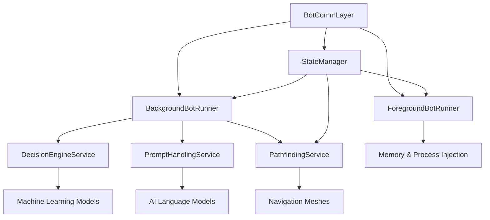
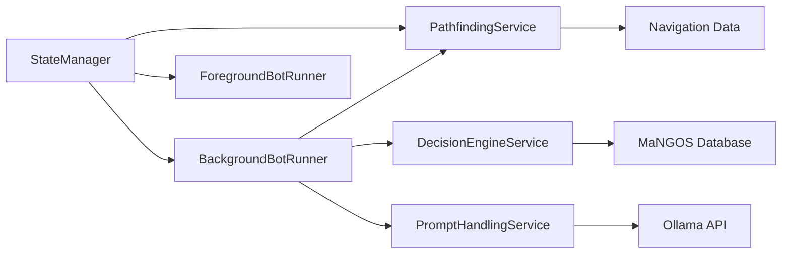

# BloogBot Services

An ecosystem of intelligent, distributed services for World of Warcraft automation, providing AI-driven bot coordination, navigation, decision-making, and execution capabilities.

## Overview

The BloogBot Services layer forms the backbone of a sophisticated multi-bot automation platform. Each service is designed as a .NET 8 Worker Service, providing specific capabilities that work together to create intelligent, autonomous World of Warcraft characters.

### Service Architecture



## Core Services

### [StateManager](StateManager/README.md) - Central Orchestrator
**Purpose**: Multi-bot coordination and state management hub

**Key Features**:
- **Character State Management**: Tracks and manages individual character states and activities
- **Background Bot Orchestration**: Automatically starts and manages bot instances for each configured character
- **Socket Communication**: Real-time TCP socket listeners for inter-service communication
- **Account Management**: Integrates with MaNGOS SOAP API for automatic account creation
- **Service Coordination**: Automatically launches dependent services like PathfindingService

**Communication Ports**:
- Character State Listener: `5002`
- State Manager Listener: `8088`
- PathfindingService: `5000`

### [BackgroundBotRunner](BackgroundBotRunner/README.md) - Autonomous Execution Engine
**Purpose**: AI-driven background automation for individual characters

**Key Features**:
- **BotRunner Integration**: Executes behavior trees and automation logic
- **Network Communication**: Pure C# WoW protocol implementation via WoWSharpClient
- **AI Integration**: Connects to Ollama for intelligent decision-making
- **Service Communication**: TCP socket integration with PathfindingService and StateManager
- **Error Handling**: Comprehensive exception handling and recovery mechanisms

**Dependencies**:
- StateManager (coordination)
- PathfindingService (navigation)
- PromptHandlingService (AI responses)
- DecisionEngineService (ML decisions)

### [ForegroundBotRunner](ForegroundBotRunner/README.md) - Direct Memory Interface
**Purpose**: Advanced automation through direct memory access and process injection

**Key Features**:
- **Process Injection**: Designed for injection into the WoW game process using Loader DLL
- **Memory Management**: Direct memory reading/writing with protection mechanisms
- **Object Manager**: Real-time enumeration and management of game objects
- **Anti-Detection**: Protection against Blizzard's anti-cheat systems
- **Function Hooking**: Native function detours and calling convention support

**Security Note**: This service requires elevated privileges and is intended for educational purposes. Users must ensure compliance with applicable terms of service.

### [PathfindingService](PathfindingService/README.md) - Spatial Intelligence
**Purpose**: Advanced navigation and pathfinding using Detour navigation meshes

**Key Features**:
- **A* Pathfinding**: Optimal route calculation using navigation meshes
- **Multi-Map Support**: Handles all WoW zones with `.mmtile` navigation data
- **Line-of-Sight**: Accurate visibility and collision detection
- **TCP Socket API**: High-performance client-server architecture
- **Sub-5ms Performance**: Optimized for real-time navigation queries

**API Endpoints**:
- `CalculatePath`: Point-to-point pathfinding
- `IsLineOfSightClear`: Visibility checking
- `GetRandomPoint`: Safe position generation

### [DecisionEngineService](DecisionEngineService/README.md) - Machine Learning Brain
**Purpose**: AI-powered decision-making using machine learning models

**Key Features**:
- **ML.NET Integration**: Custom ML models for action prediction
- **Combat Prediction**: Specialized combat scenario analysis
- **Real-time Learning**: Continuous model improvement from gameplay data
- **Data Pipeline**: Automatic processing of binary game state files
- **Model Persistence**: SQLite-based model storage and versioning

**Learning Capabilities**:
- Combat action optimization
- Resource management decisions
- Threat assessment and response
- Environmental adaptation

### [PromptHandlingService](PromptHandlingService/README.md) - AI Language Integration
**Purpose**: Natural language processing and AI-enhanced automation

**Key Features**:
- **Ollama Integration**: Local LLM support for intelligent responses
- **Prompt Templates**: Structured prompts for consistent AI behavior
- **Context Management**: Maintains conversation history and game context
- **Function Calling**: AI-driven action execution through structured responses
- **Error Handling**: Graceful degradation and fallback mechanisms

**AI Capabilities**:
- Natural language command processing
- Intelligent quest dialogue
- Social interaction automation
- Dynamic response generation

## Configuration & Deployment

### Prerequisites
- **.NET 8 SDK** or later
- **MySQL Database** (MaNGOS/TrinityCore compatible)
- **SQLite** for local data storage
- **Ollama** (optional, for AI features)
- **Navigation Data** (`.mmtile` files for pathfinding)

### Service Dependencies



### Deployment Options

#### Development Environment
```bash
# Start core services
dotnet run --project Services/StateManager
dotnet run --project Services/PathfindingService

# Services will auto-start additional components
```

#### Production Deployment
```bash
# Windows Service Installation
sc create StateManager binPath="StateManager.exe"
sc create PathfindingService binPath="PathfindingService.exe"

# Linux systemd
sudo systemctl enable statemanager.service
sudo systemctl enable pathfinding.service
```

#### Docker Support
```dockerfile
# Multi-service deployment available
FROM mcr.microsoft.com/dotnet/aspnet:8.0
# See individual service README files for specific configurations
```

## Communication Protocols

### Inter-Service Communication
- **Protocol Buffers**: Structured messaging via [BotCommLayer](../Exports/BotCommLayer/README.md)
- **TCP Sockets**: Real-time communication between services
- **HTTP/REST**: External API integration (Ollama, MaNGOS SOAP)

### Port Allocation
| Service | Port | Purpose |
|---------|------|---------|
| StateManager | 8088 | State management API |
| Character State | 5002 | Character activity monitoring |
| PathfindingService | 5000 | Navigation queries |
| MaNGOS SOAP | 7878 | Game server integration |

## Monitoring & Observability

### Logging
All services use structured logging with configurable levels:
- **Information**: Service lifecycle and major operations
- **Debug**: Detailed operational tracing
- **Error**: Exception details and recovery actions

### Performance Metrics
- **Pathfinding**: Sub-5ms response times
- **Decision Engine**: ML model accuracy tracking
- **Memory Usage**: Real-time monitoring for process injection
- **Network Latency**: Communication between services

## Testing

### Unit Tests
```bash
# Run all service tests
dotnet test Tests/PathfindingService.Tests
dotnet test Tests/BotRunner.Tests
dotnet test Tests/WoWSharpClient.Tests
dotnet test Tests/PromptHandlingService.Tests
```

### Integration Testing
```bash
# Full ecosystem testing
dotnet test Tests/ --filter Category=Integration
```

## Security Considerations

### Process Injection (ForegroundBotRunner)
- Requires elevated privileges
- May trigger antivirus warnings
- Educational/research purposes only
- No warranty for detection avoidance

### Network Security
- Encrypted WoW protocol communication
- Secure configuration storage using .NET user secrets
- Service isolation and sandboxing

### Anti-Detection
- Anti-Warden protection (educational)
- Randomized timing and behavior patterns
- Memory protection and cleanup

## Development Guidelines

### Adding New Services
1. **Create Worker Service**: Use .NET 8 Worker Service template
2. **Implement IHostedService**: Follow established patterns
3. **Add Configuration**: Use `appsettings.json` and user secrets
4. **Communication**: Integrate with BotCommLayer for messaging
5. **Testing**: Include unit and integration tests
6. **Documentation**: Follow README template

### Code Standards
- **.NET 8**: Target framework with C# 12 features
- **Async/Await**: Non-blocking operations throughout
- **Nullable References**: Enabled for null safety
- **Dependency Injection**: Constructor injection pattern
- **Structured Logging**: Microsoft.Extensions.Logging

### Performance Requirements
- **Startup Time**: Services should start within 10 seconds
- **Memory Usage**: Monitor and optimize for long-running operations
- **CPU Efficiency**: Balance responsiveness with resource usage
- **Network Optimization**: Minimize bandwidth and latency

## Service Lifecycle

### Startup Sequence
1. **StateManager** starts and loads configuration
2. **PathfindingService** launches (auto-started by StateManager)
3. **Character-specific services** spawn based on configuration
4. **AI services** initialize models and connections
5. **Communication channels** establish between all services

### Shutdown Sequence
1. **Graceful termination** signals sent to all services
2. **Active operations** complete or timeout
3. **Resources cleanup** (memory, file handles, connections)
4. **State persistence** for resumable operations

## Additional Resources

### Related Documentation
- **[BloogBot.AI](../BloogBot.AI/README.md)**: Core AI behavior coordination
- **[Exports Layer](../Exports/README.md)**: Shared libraries and communication
- **[UI Components](../UI/README.md)**: Management and monitoring interfaces

### External Dependencies
- **[Detour Navigation](../Exports/Navigation/README.md)**: C++ pathfinding library
- **[WoW Protocol](../Exports/WoWSharpClient/README.md)**: Pure C# client implementation
- **[Process Injection](../Exports/Loader/README.md)**: Native code hosting

### Contributing
1. **Fork the repository** and create feature branches
2. **Follow established patterns** and architectural guidelines
3. **Add comprehensive tests** for new functionality
4. **Update documentation** including README files
5. **Performance testing** to ensure scalability

## License

This project is part of the BloogBot ecosystem. Please refer to the main project license for usage terms.

---

*The BloogBot Services layer provides a robust, scalable foundation for intelligent World of Warcraft automation, combining cutting-edge AI, sophisticated pathfinding, and advanced process interaction techniques to create autonomous, intelligent game characters.*
